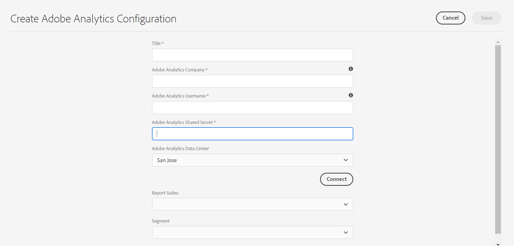

# 整合 Adobe Analytics{#integrating-with-adobe-analytics}

將Adobe Analytics和AEM整合為雲端服務，可讓您追蹤網頁活動。 整合需要：

* 使用Touch UI在AEM中建立Analytics設定作為雲端服務。
* 在 [Adobe Launch中新增及設定Adobe Analytics做為擴充功能](#analytics-launch)。 如需Adobe Launch的詳細資訊，請參 [閱本頁](https://docs.adobe.com/content/help/en/launch/using/intro/get-started/quick-start.html)。

與舊版AEM相比，AEM中的Analytics設定中未提供架構支援（即雲端服務）。 現在可以透過Adobe Launch完成，Adobe Launch是實際工具，可用來使用Analytics功能（JS資料庫）來檢測AEM網站。 在Adobe Launch中，會建立屬性，可在其中設定Adobe Analytics擴充功能，並建立規則以傳送資料至Adobe Analytics。 Adobe Launch已取代sitecatalyst提供的分析工作。

>[!NOTE]
>
>Adobe Experience Manager是Cloud Service客戶，如果客戶沒有現有的Analytics帳戶，可以要求存取Analytics Foundation Pack for Experience Cloud。 此Foundation Pack提供Analytics的使用量有限。

## 建立Adobe Analytics設定 {#analytics-configuration}

1. 導覽至「 **工具** 」→ **「雲端服務」**。
2. 選取 **Adobe Analytics**。
   
3. 選擇「創 **建** 」按鈕。
4. 填寫詳細資訊（請參閱下面），然後按一下「連 **接」**。

### 配置參數 {#configuration-parameters}

「Adobe Analytics設定」視窗中的設定欄位包括：

| 屬性 | 說明 |
|---|---|
| 公司 | Adobe Analytics登入公司 |
| 使用者名稱 | Adobe Analytics API使用者 |
| 密碼 | 用於驗證的Adobe Analytics密碼 |
| 資料中心 | 您帳戶所關聯的Adobe Analytics資料中心（例如San Jose, London等伺服器） |
| 區段 | 使用目前報表套裝中定義之Analytics區段的選項。 Analytics報表會根據區段進行篩選。 請參閱 [本頁](https://docs.adobe.com/content/help/en/analytics/components/segmentation/seg-overview.html) ，以取得詳細資訊。 |
| 報表套裝 | 傳送資料和提取報表的儲存庫。 報表套裝會定義所選網站、網站集或網站頁面子集的完整獨立報表。 您可以檢視從單一報表套裝擷取的報表，並可隨時根據您的需求在設定中編輯此欄位。 |

### 新增設定至網站 {#add-configuration}

若要將Touch UI設定套用至網站，請前往： **Sites** 選擇任何網站頁 **→** Properties **** → Advanced **→ Configuration****** → Select configuration租用戶。

## 使用Adobe Launch將Adobe Analytics整合在AEM網站上 {#analytics-launch}

Adobe Analytics可新增為Launch屬性中的擴充功能。 可定義規則，以執行對應並對Adobe Analytics進行貼文呼叫：

* 觀看 [此影片](https://docs.adobe.com/content/help/en/analytics-learn/tutorials/implementation/via-adobe-launch/basic-configuration-of-the-analytics-launch-extension.html) ，瞭解如何在Launch中為基本網站設定Analytics擴充功能。

* 如需 [如何建立規則](https://docs.adobe.com/content/help/en/core-services-learn/implementing-in-websites-with-launch/implement-solutions/analytics.html) ，以及如何將資料傳送至Adobe Analytics的詳細資訊，請參閱本頁。

>[!NOTE]
>
>現有（舊版）架構仍然有效，但無法在Touch UI中設定。 建議在Launch中重建變數對應設定。

>[!NOTE]
>
>Launch的IMS設定（技術帳戶）已在AEM中預先設定為雲端服務。 使用者不必建立此設定。
