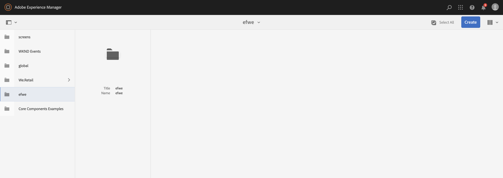

# 整合 Adobe Target{#integrating-with-adobe-target}

作為Adobe Marketing Cloud的一部分，Adobe Target可讓您透過跨所有通道的鎖定和測量，提高內容關聯性。 整合Adobe TargetAEM和Cloud Service需要：

* 使用Touch UI以建立「目標設定」做為AEMCloud Service（需要IMS設定）。
* 在[AdobeLaunch](https://docs.adobe.com/content/help/en/launch/using/intro/get-started/quick-start.html)中添加和配置Adobe Target作為擴展。

Adobe啟動是管理頁面（JS程式庫／標籤）中Analytics和Target用戶端屬AEM性的必要條件。 儘管如此，Launch需要整合，才能「體驗定位」。 若是「體驗片段」匯出至Target，您只需要「Adobe Target設定」和IMS。

>[!NOTE]
>
>Adobe Experience Manager作為沒有現有Target帳戶的Cloud Service客戶，可請求存取Target Foundation Pack以進行Experience Cloud。 Foundation Pack提供對Target的卷有限使用。

## 建立Adobe Target配置{#create-configuration}

1. 導覽至&#x200B;**工具** → **Cloud Services**。
   
2. 選擇&#x200B;**Adobe Target**。
3. 選擇&#x200B;**建立**按鈕。
   
4. 填寫詳細資訊（請參閱下面），然後選擇&#x200B;**Connect**。
   

### IMS 設定 {#ims-configuration}

Launch和Target的IMS設定必須能正確整合Target與AEMLaunch。 當啟動的IMS設定預先設定AEM為Cloud Service時，必須建立目標IMS設定（在布建目標後）。 請參閱[此視訊](https://helpx.adobe.com/experience-manager/kt/sites/using/aem-sites-target-standard-technical-video-understand.html)和[本頁](https://docs.adobe.com/content/help/en/experience-manager-65/administering/integration/integration-ims-adobe-io.html)以瞭解如何建立Target IMS設定。

### Adobe Target租用戶ID和Adobe Target用戶端代碼{#tenant-client}

設定「Adobe Target租用戶ID」和「Adobe Target用戶端代碼」欄位時，請注意下列事項：

1. 對於大部分客戶而言，租用戶ID和用戶端代碼是相同的。 這表示這兩個欄位都包含相同的資訊，而且完全相同。 請務必在這兩個欄位中輸入租用戶ID。
2. 為了舊版用途，您也可以在「租用戶ID」和「用戶端代碼」欄位中輸入不同的值。

在這兩種情況下，請注意：

* 依預設，「用戶端代碼」（如果先新增）也會自動複製到「租用戶ID」欄位。
* 您可以選擇變更預設租用戶ID集。
* 因此，對Target的後端呼叫將以租用戶ID為基礎，而對Target的用戶端呼叫則以用戶端代碼為基礎。

如前所述，第一個案例是作為Cloud Service最AEM常見的案例。 無論如何，請確定&#x200B;**both**&#x200B;欄位皆包含正確的資訊，視您的需求而定。

>[!NOTE]
>
> 如果要更改現有的Target配置：
>
> 1. 重新輸入租用戶ID。
> 2. 重新連線至Target。
> 3. 儲存設定。

### 編輯目標配置{#edit-target-configuration}

若要編輯Target設定，請依照下列步驟進行：

1. 選擇現有配置，然後按一下&#x200B;**屬性**。
2. 編輯屬性。
3. 選擇&#x200B;**重新連接到Adobe Target**。
4. 選擇&#x200B;**保存並關閉**。

### 將配置添加到站點{#add-configuration}

若要將Touch UI設定套用至網站，請前往：**Sites** → **選擇任何站點頁** → **Properties** → **Advanced** → **Configuration** → Select the configuration the the configuration tenant.

## 使用AdobeAEM啟動{#integrate-target-launch}將Adobe Target整合在網站上

提AEM供與Experience Platform Launch的立即可用整合。 將Adobe Target擴展添加到Experience Platform Launch後，可以在網頁上使用Adobe Target的AEM功能。 Target程式庫只能透過使用Launch來轉譯。

>[!NOTE]
>
>現有（舊版）架構仍然有效，但無法在Touch UI中設定。 建議在Launch中重建變數對應設定。

作為一般概觀，整合步驟包括：

1. 建立啟動屬性
2. 新增所需的擴充功能
3. 建立資料元素（以擷取內容中樞參數）
4. 建立頁面規則
5. 建立和發佈

### 建立啟動屬性{#create-property}

屬性是填入擴充功能、規則、資料元素的容器。

1. 選擇&#x200B;**新建屬性**&#x200B;按鈕。
2. 提供您屬性的名稱。
3. 在網域中輸入要載入啟動程式庫的IP/主機。
4. 選擇&#x200B;**保存**按鈕。
   

### 添加所需的副檔名{#add-extension}

**擴** 充管理核心程式庫設定的容器。Adobe Target擴充功能支援用戶端實作，方法是使用Target JavaScript SDK for the modern web, at.js。 您必須同時添加&#x200B;**Adobe Target**&#x200B;和&#x200B;**AdobeContextHub**&#x200B;副檔名。

1. 選取「擴充目錄」選項，並在篩選中搜尋「目標」。
2. 選擇&#x200B;**Adobe Target** at.js ，然後按一下「Install（安裝）」選項。
   
3. 選擇&#x200B;**Configure**&#x200B;按鈕。 請注意，設定視窗中已匯入Target帳戶認證，且此擴充功能的at.js版本已匯入。
4. 選擇&#x200B;**Save**&#x200B;將Target擴充功能新增至您的Launch屬性。 您應該可以看到&#x200B;**Installed Extensions**清單下所列的Target擴充功能。
   
5. 重複上述步驟以搜尋&#x200B;**AdobeContextHub**&#x200B;擴充功能並安裝它（這是與contexthub參數整合時所需的，根據目標設定）。

### 建立資料元素{#data-element}

**資料** 元素是您可將內容中樞參數映射至的預留位置。

1. 選擇&#x200B;**資料元素**。
2. 選擇&#x200B;**添加資料元素**。
3. 提供資料元素的名稱，並將其對應至內容中樞參數。
4. 選擇&#x200B;**保存**。
   

### 建立頁面規則{#page-rule}

在&#x200B;**Rule**&#x200B;中，我們定義並排序一系列在網站上執行的動作，以達成目標。

1. 新增一組動作，如螢幕擷取中所示。
   
2. 在新增參數至所有Mbox中，將先前設定的資料元素（請參閱上述資料元素）新增至將在mbox呼叫中傳送的參數。
   

### 建立和發佈{#build-publish}

若要瞭解如何建立和發佈，請參閱此[頁面](https://docs.adobe.com/content/help/en/experience-manager-learn/aem-target-tutorial/aem-target-implementation/using-launch-adobe-io.html)。

## Classic和Touch UI組態之間的內容結構變更{#changes-content-structure}

| **變更** | **傳統UI配置** | **Touch UI設定** | **後果** |
|---|---|---|---|
| 目標配置的位置。 | /etc/cloudservices/testandtarget/ | /conf/tenant/settings/cloudservices/target | 先前的多個組態都存在於/etc/cloudservices/testandtarget下，但現在租用戶下有單一組態。 |

>[!NOTE]
>
>現有客戶仍支援舊版設定（沒有編輯或建立新設定的選項）。 舊版配置是使用VSTS的客戶上傳的內容套件的一部分。
