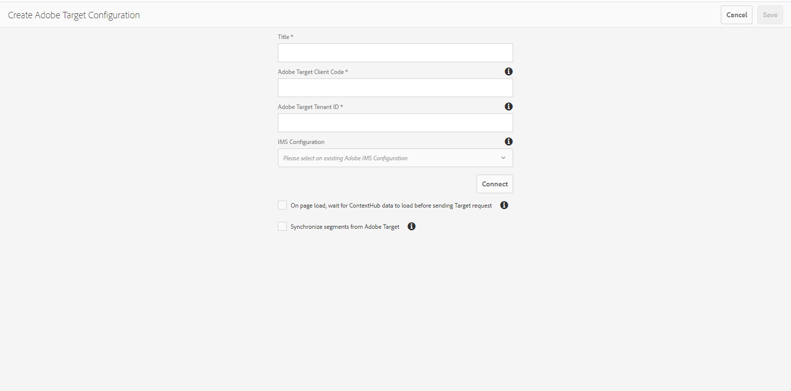

# 整合 Adobe Target{#integrating-with-adobe-target}

Adobe Target是Adobe Experience Cloud的一部分，可讓您透過針對所有管道進行定位和測量，提升內容關聯性。 整合Adobe Target和AEMas a Cloud Service需要：

* 使用Touch UI在AEMas a Cloud Service中建立Target設定（需要IMS設定）。
* 在中將Adobe Target新增及設定為擴充功能 [Adobe啟動](https://experienceleague.adobe.com/docs/experience-platform/tags/get-started/quick-start.html).

管理AEM頁面（JS資料庫/標籤）中Analytics和Target的使用者端屬性時，需要Adobe Launch。 也就是說，「體驗鎖定目標」需要與Launch整合。

若要將體驗片段和/或內容片段匯出至Target，您只需要 [Adobe Target設定和IMS](/help/sites-cloud/integrating/integration-adobe-target-ims.md).

>[!NOTE]
>
>沒有現有Target帳戶的客戶，可要求存取Target Foundation Pack以進行Experience Cloud。 Foundation Pack提供磁碟區有限的Target使用。

## 建立Adobe Target設定 {#create-configuration}

1. 瀏覽至 **工具** → **Cloud Services**.
   
2. 選取 **Adobe Target**.
3. 選取 **建立** 按鈕。
   
4. 填寫詳細資訊（請參閱下文），然後選取 **連線**.
   

### IMS 設定 {#ims-configuration}

需要適用於Launch和Target的IMS設定，才能將Target與AEM和Launch正確整合。 雖然已在AEMas a Cloud Service中預先設定Launch的IMS設定，但必須建立Target IMS設定（在布建Target後）。 另請參閱 [與Adobe Target整合時使用的IMS設定](/help/sites-cloud/integrating/integration-adobe-target-ims.md) 和視訊 [整合Experience Platform Launch和AEM](https://experienceleague.adobe.com/docs/experience-manager-learn/sites/integrations/experience-platform-data-collection-tags/overview.html) 以瞭解如何建立Target IMS設定。

### Adobe Target租使用者ID和Adobe Target使用者端代碼 {#tenant-client}

設定Adobe Target租使用者ID和Adobe Target使用者端代碼欄位時，請注意下列事項：

1. 對於大多數客戶而言，租使用者ID和使用者端代碼是相同的。 也就是說，兩個欄位包含相同的資訊且相同。 請務必在兩個欄位中輸入租使用者ID。
2. 若是舊版用途，您也可以在「租使用者ID」和「使用者端代碼」欄位中輸入不同的值。

在這兩種情況下：

* 依預設，使用者端代碼（如果先新增）也會自動複製到「租使用者ID」欄位中。
* 如有需要，您可以變更預設租使用者ID集。
* 對Target進行的後端呼叫是根據租使用者ID，而對Target進行的使用者端呼叫是根據使用者端代碼。

如前所述，第一個案例是AEMas a Cloud Service最常見的情況。 無論是哪一種方式，請確定 **兩者** 欄位包含正確的資訊，具體取決於您的需求。

>[!NOTE]
>
> 如果您想要變更現有的Target組態：
>
> 1. 重新輸入租使用者ID。
> 2. 重新連線到Target。
> 3. 儲存設定。

### 編輯Target設定 {#edit-target-configuration}

若要編輯Target設定，請依照下列步驟執行：

1. 選取現有設定並按一下 **屬性**.
2. 編輯屬性。
3. 選取 **重新連線到Adobe Target**.
4. 選取 **儲存並關閉**.

### 將設定新增至站台 {#add-configuration}

若要將Touch UI設定套用至網站，請前往： **網站** > **選取任何網站頁面** > **屬性** > **進階** > **設定** >選取設定租使用者。

## 使用Adobe Launch在AEM網站上整合Adobe Target {#integrate-target-launch}

AEM提供與Experience Platform Launch的現成整合。 將Adobe Target擴充功能新增至Experience Platform Launch後，您就可以在AEM網頁上使用Adobe Target的功能。 Target資料庫僅能使用Launch來呈現。

>[!NOTE]
>
>現有（舊版）架構仍可運作，但無法在Touch UI中設定。 Adobe建議您在Launch中重建變數對應設定。

作為一般概述，整合步驟為：

1. 建立Launch屬性
2. 新增必要的擴充功能
3. 建立資料元素（以擷取內容中樞引數）
4. 建立頁面規則
5. 建置並發佈

### 建立Launch屬性 {#create-property}

屬性是一個內含擴充功能、規則和資料元素的容器。

1. 選取 **新增屬性** 按鈕。
2. 提供屬性的名稱。
3. 網域請輸入要載入Launch程式庫的IP/主機。
4. 選取 **儲存** 按鈕。
   

### 新增必要的擴充功能 {#add-extension}

**擴充功能** 是管理核心程式庫設定的容器。 Adobe Target擴充功能將Target JavaScript SDK用於現代網路at.js，以支援使用者端實施。 新增兩個 **Adobe Target** 和 **AdobeContextHub** 擴充功能。

1. 選取「擴充功能目錄」選項，然後在篩選器中搜尋Target。
2. 選取 **Adobe Target** at.js，然後按一下「安裝」選項。
   
3. 選取 **設定** 按鈕。 請注意已匯入Target帳戶憑證的設定視窗，以及此擴充功能的at.js版本。
4. 選取 **儲存** 新增Target擴充功能至您的Launch屬性。 您應該能夠看到Target擴充功能列在 **已安裝的擴充功能** 清單。
   
5. 重複上述步驟以搜尋 **AdobeContextHub** 擴充功能並安裝（此擴充功能是與contexthub引數整合的必要條件，視目標定位完成而定）。

### 建立資料元素 {#data-element}

**資料元素** 是可對應內容中樞引數的預留位置。

1. 選取 **資料元素**.
2. 選取 **新增資料元素**.
3. 提供資料元素的名稱，並將其對應至內容中心引數。
4. 選取&#x200B;**儲存**。
   

### 建立頁面規則 {#page-rule}

在 **規則**，它會定義並排序在網站上執行以達成鎖定目標的一系列動作。

1. 新增一組動作，如熒幕擷圖所示。
   
2. 在Add Params to All Mboxes中，將先前設定的資料元素（請參閱上述資料元素）新增至mbox呼叫中傳送的引數。
   

### 建置並發佈 {#build-publish}

若要瞭解如何建置和發佈，請參閱 [頁面](https://experienceleague.adobe.com/docs/experience-manager-learn/aem-target-tutorial/aem-target-implementation/using-launch-adobe-io.html).

## 傳統和觸控式UI設定之間的內容結構變更 {#changes-content-structure}

<table style="table-layout:auto">
  <tr>
    <th>變更</th>
    <th>傳統UI設定</th>
    <th>Touch UI設定</th>
    <th>結果</th>
  </tr>
  <tr>
    <td>Target設定的位置。</td>
    <td>/etc/cloudservices/testandtarget/</td>
    <td>/conf/tenant/settings/cloudconfigs/target/</td>
    <td> 之前，多個設定位於/etc/cloudservices/testandtarget下，但現在單一設定位於租使用者下。</td>
  </tr>
</table>

>[!NOTE]
>
>現有客戶仍支援舊版設定（無法編輯或建立）。 舊版設定是客戶使用VSTS上傳的內容套件的一部分。
