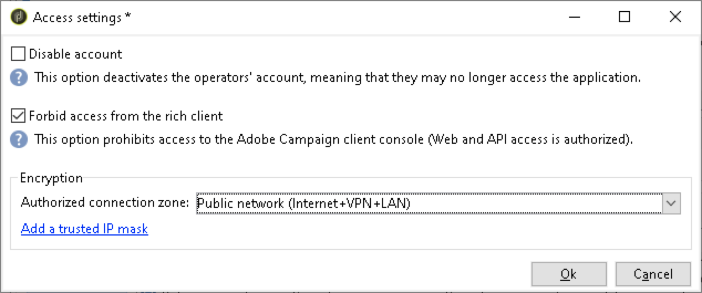
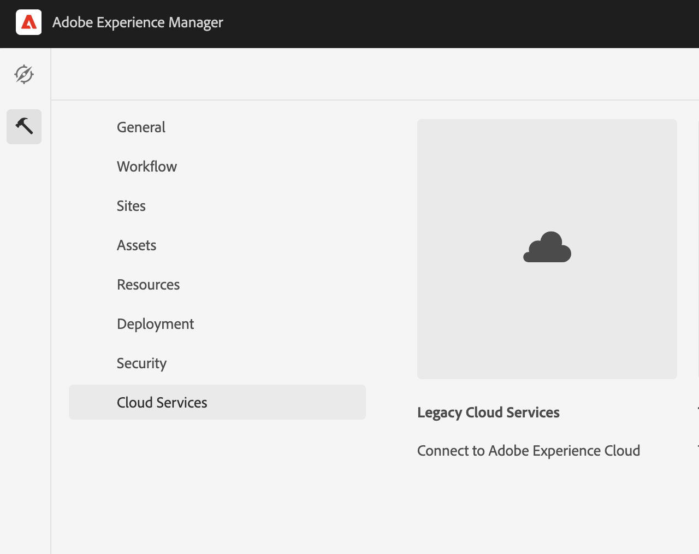

# 與Adobe Campaign Classic整合 {#integrating-campaign-classic}

通過與Adobe Campaign整合，您可以直接在as a Cloud Service中管理電子郵件傳送、內容和AEM表單。 需要在Adobe Campaign Classic和AEMas a Cloud Service中執行配置步驟，以便實現解決方案之間的雙向通信。

請注意，AEMas a Cloud Service和Adobe Campaign Classic也可獨立使用。 例如，營銷人員可以在Adobe Campaign建立市場活動和使用目標，而內容建立者可以在as a Cloud Service中進行AEM設計。

## 整合工作流 {#integration-workflow}

以下各章詳細介紹了如何整合解決方案。 這需要在Adobe Campaign Classic和AEMas a Cloud Service中執行配置步驟。 因此，您將學習如何：

* [建立操作員用戶](#create-operator)
* [配置AEM整合as a Cloud Service](#aem-configuration)
* [配置市場活動遠程用戶](#configure-user)
* [設定Adobe Campaign Classic外部帳戶](#acc-setup)

### 必備條件 {#prerequisites}

**Adobe Campaign Classic**

要執行整合，您需要一個工作的Adobe Campaign Classic實例，包括一個資料庫。 如果您需要有關如何設定和配置Adobe Campaign Classic的其他詳細資訊，請閱讀 [Adobe Campaign Classic文檔](https://experienceleague.adobe.com/docs/campaign-classic/using/campaign-classic-home.html) 尤其是《安裝及設定指南》。 請記住，要執行下面介紹的操作，您還需要具有管理員角色。

**AEM as a Cloud Service**

你需要 [AEMas a Cloud Service](https://experienceleague.adobe.com/docs/experience-manager-cloud-service/content/overview/introduction.html) 解決方案。

### 在Adobe Campaign Classic建立操作員用戶 {#create-operator}

從「開始」菜單開啟Adobe Campaign Classic客戶端控制台並登錄。 應出現首頁。

1. 按一下 **瀏覽器** 開啟瀏覽器視圖。
   
1. 在左側的樹視圖中，導航到 **管理 — >訪問管理 — >操作員**。
1. 按兩下 `aemserver` 的子菜單。
1. 切換到 **編輯** 頁籤。 設定AemServer的密碼。
   
1. 按一下 **訪問權限** ，然後按一下 **編輯訪問參數** 連結。
1. 在「加密」下，選擇「公共網路」作為授權連接區域。 按一下&#x200B;**「確定」**。
   
1. 按一下「**儲存**」。
1. 註銷。
1. 例如，轉到Adobe Campaign Classicv7安裝位置 `C:\Program Files\Adobe\Adobe Campaign Classic v7\conf` 開啟 `serverConf.xml` 作為管理員。
   * 搜索 **安全區**。
   * 設定以下參數 `allowHTTP="true"` `sessionTokenOnly="true"` `allowUserPassword="true"`。
   * 儲存檔案。
1. 確保安全區域不會被中的相應設定覆蓋 `config-<server name>.xml` 檔案(C:\Program Files\Adobe\Adobe Campaign Classic v7\conf\config_acc-test.xml)。
   * 如果配置檔案包含單獨的安全區域設定，則更改 `allowUserPassword` 屬性為true。
1. 如果要更改Adobe Campaign Classic伺服器埠，請將8080替換為所需埠(例如：80)。

>[!NOTE]
>
>預設情況下，沒有為操作員配置安全區域。 要使用as a Cloud Service連AEM接到Adobe Campaign，必須選擇一個（請參閱上面的步驟）。 我們強烈建議建立專用於避免任何AEM安全問題的安全區。

### 配置AEM為雲服務 {#aem-configuration}

1. 登錄到雲管理器並啟動AEMas a Cloud Service作者實例。
1. 轉到 **工具→Cloud Service→舊Cloud Service**。
   
1. 向下滾動到Adobe Campaign，然後按一下 **立即配置** 的子菜單。
   * 輸入標題。
   * 輸入名稱。
   * 按一下&#x200B;**建立**。
1. 在「編輯元件」螢幕上
   * 輸入用戶名，請參閱 [建立操作員用戶](#create-operator)。
   * 輸入密碼。
   * 輸入Adobe Campaign Classic伺服器API終點(例如， `http://3.22625.51:80`)。
   * 按一下 **連接到Adobe Campaign**。
   * 按一下&#x200B;**「確定」**。

   >[!NOTE]
   >
   >請確保您的Adobe Campaign伺服器在Internet上可以訪問，AEM因為as a Cloud Service無法訪問專用網路。
1. 請檢查連結外部化器配置中的發佈實例。
通過檢查OSGi服務在 [開發者控制台](https://experienceleague.adobe.com/docs/experience-manager-learn/cloud-service/debugging/debugging-aem-as-a-cloud-service/developer-console.html#osgi-services)。
如果不正確，則在相應實例git儲存庫中進行更改，然後使用 [雲管理器](https://experienceleague.adobe.com/docs/experience-manager-cloud-service/content/implementing/using-cloud-manager/deploy-code.html)。

```
Service 3310 - [com.day.cq.commons.Externalizer] (pid: com.day.cq.commons.impl.ExternalizerImpl)",
"  from Bundle 420 - Day Communique 5 Commons Library (com.day.cq.cq-commons), version 5.12.16",
"    component.id: 2149",
"    component.name: com.day.cq.commons.impl.ExternalizerImpl",
"    externalizer.contextpath: ",
"    externalizer.domains: [local https://author-p17558-e33255-cmstg.adobeaemcloud.com, author https://author-p17558-e33255-cmstg.adobeaemcloud.com,
     publish https://publish-p17558-e33255-cmstg.adobeaemcloud.com]",
"    externalizer.encodedpath: false",
"    externalizer.host: ",
"    feature-origins: [com.day.cq:cq-quickstart:slingosgifeature:cq-platform-model_quickstart_author:6.6.0-V23085]",
"    service.bundleid: 420",
"    service.description: Creates absolute URLs",
"    service.scope: bundle",
"    service.vendor: Adobe Systems Incorporated",
```

>[!NOTE]
>
>還必須從Adobe Campaign伺服器訪問發佈實例。

### 配置Adobe Campaign遠程用戶 {#configure-user}

您需要為市場活動遠程用戶設定密碼。 必須將Adobe Campaign Classic連接AEM為雲服務。

1. 轉到 **AEM→工具→安全→用戶**。
   
1. 搜索 `campaign-remote` 並按一下。
1. 按一下更改密碼
   * 輸入兩次新密碼。
   * 輸入AEM密碼。
   * 按一下「**儲存**」。

### 配置Adobe Campaign Classic外部帳戶 {#acc-setup}

您還必須配置外部帳戶才能將Adobe Campaign Classic與as a Cloud Service實AEM例連接。

1. 使用客戶端控制台登錄Adobe Campaign Classic伺服器。
1. 轉到瀏覽器視圖。
1. 在左側的樹視圖中，轉到 **管理→平台→外部帳戶**。
1. 在右上角的清單視圖中，按一下AEM實例。
1. 在實例AEM配置中
   * 輸入AEMas a Cloud Service作者IP/FQN `https://author-p17558-e33255-cmstg.adobeaemcloud.com`。
   * 輸入用戶和帳戶。
   * 輸入您在as a Cloud Service實例中設定的市場活動遠程用AEM戶的密碼（請參閱上面的步驟）。
   * 選擇 **已啟用** 複選框。
   * 按一下「**儲存**」。

   >[!NOTE]
   >
   >必須從Adobe Campaign Classic伺服器實例訪問AEM作者伺服器IP/FQN。 另外，不要在AEM Author伺服器IP/FQN中添加反斜線字元。

配置了Adobe Campaign Classic和AEMas a Cloud Service後，整合現已完成。 此外，您還可以通過閱讀 [此頁](/help/sites-cloud/integrating/creating-newsletter.md)。
