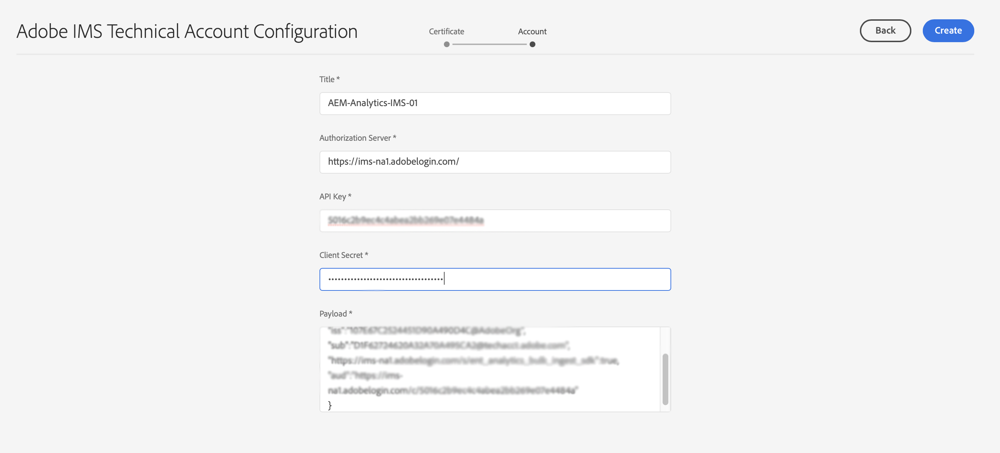

# IMS設定，以在與Adobe Analytics整合時使用 {#ims-configuration-for-integration-with-adobe-analytics}

透過Analytics Standard API整合Adobe Experience Manager as a Cloud Service(AEMaCS)與Adobe Analytics時，需要設定Adobe IMS(Identity Management系統)。 設定是透過Adobe Developer主控台實現。

>[!NOTE]
>
>AEMaaCS 2022.2.0新增了對Adobe Analytics Standard API 2.0的支援。此版本的API支援IMS驗證。
>
>API選取由用於AEM/Analytics整合的驗證方法驅動。
>
>進一步資訊也可在 [移轉至2.0 API](https://developer.adobe.com/analytics-apis/docs/2.0/guides/migration/).

## 必備條件 {#prerequisites}

開始此過程之前：

* [Adobe支援](https://helpx.adobe.com/tw/contact/enterprise-support.ec.html) 必須為您配置帳戶：

   * Adobe主控台
   * Adobe Developer Console
   * Adobe Analytics和
   * Adobe IMS(Identity Management系統)

* 貴組織的系統管理員應使用Admin Console，將貴組織中所需的開發人員新增至相關的產品設定檔。

   * 這可為特定開發人員提供使用Adobe Developer主控台啟用整合的權限。
   * 如需詳細資訊，請參閱 [管理開發人員](https://helpx.adobe.com/enterprise/admin-guide.html/enterprise/using/manage-developers.ug.html).

## 設定IMS設定 — 產生公開金鑰 {#configuring-ims-generating-a-public-key}

設定的第一階段是在AEM中建立IMS設定並產生公開金鑰。

1. 在AEM中開啟 **工具** 功能表。
1. 在 **安全性** 節選 **Adobe IMS設定**.
1. 選擇 **建立** 開啟 **Adobe IMS技術帳戶設定**.
1. 使用下拉式清單 **雲端設定**，選取 **Adobe Analytics**.
1. 啟動 **建立新憑證** 並輸入新別名。
1. 確認為 **建立憑證**.

   

1. 選擇 **下載** (或 **下載公開金鑰**)將檔案下載到本機磁碟，以便在 [設定IMS for Adobe Analytics與AEM整合](#configuring-ims-adobe-analytics-integration-with-aem).

   >[!CAUTION]
   >
   >請保持此設定開啟，當 [在AEM中完成IMS設定](#completing-the-ims-configuration-in-aem).

   

## 為Adobe Analytics設定IMS與AEM整合 {#configuring-ims-adobe-analytics-integration-with-aem}

使用Adobe Developer Console時，您需要使用Adobe Analytics建立專案（整合）(以供AEM使用)，然後指派所需的權限。

### 建立專案 {#creating-the-project}

開啟Adobe Developer Console以使用AEM將使用的Adobe Analytics建立專案：

1. 開啟專案的Adobe Developer Console:

   [https://developer.adobe.com/console/projects](https://developer.adobe.com/console/projects)

1. 將顯示您擁有的任何專案。 選擇 **建立新專案**  — 位置和使用取決於：

   * 如果您尚未建立任何專案， **建立新專案** 中間，底部。
      
   * 如果您已有現有專案，則會列出 **建立新專案** 右上角。
      

1. 選擇 **新增至專案** 後跟 **API**:

   

1. 選擇 **Adobe Analytics**，然後 **下一個**:

   >[!NOTE]
   >
   >如果您已訂閱Adobe Analytics，但未看到其列出，則應檢查 [必要條件](#prerequisites).

   

1. 選擇 **服務帳戶(JWT)** 作為驗證類型，請繼續 **下一個**:

   

1. **上傳您的公開金鑰**，完成時，繼續 **下一個**:

   

1. 查看憑據，然後繼續 **下一個**:

   

1. 選取所需的產品設定檔，然後繼續 **儲存已設定的API**:

   

1. 將會確認設定。

### 為整合指派權限 {#assigning-privileges-to-the-integration}

您現在必須將必要的權限指派給整合：

1. 開啟Adobe **Admin Console**:

   * [https://adminconsole.adobe.com](https://adminconsole.adobe.com/)

1. 導覽至 **產品** （頂端工具列），然後選取 **Adobe Analytics - &lt;*your-tenant-id*>** （從左側面板）。
1. 選擇 **產品設定檔**，則會從顯示的清單中取得您所需的工作區。 例如，預設工作區。
1. 選擇 **API憑證**，然後是必要的整合設定。
1. 選擇 **編輯器** 作為 **產品角色**;而非 **觀察者**.

## 儲存於Adobe Developer主控台整合專案的詳細資料 {#details-stored-for-the-ims-integration-project}

從Adobe Developer Console - 「專案」中，您可以看到所有整合專案的清單：

* [https://developer.adobe.com/console/projects](https://developer.adobe.com/console/projects)

選取特定專案項目，以顯示有關設定的詳細資訊。 這些包括：

* 專案概述
* 分析
* 憑證
   * 服務帳戶(JWT)
      * 憑據詳細資訊
      * 產生JWT
* API
   * 例如，Adobe Analytics

其中部分作業需要根據IMS完成Adobe Analytics與AEM的整合。

## 在AEM中完成IMS設定 {#completing-the-ims-configuration-in-aem}

回到AEM後，您就可以從Analytics的IMS整合新增必要值，以完成IMS設定：

1. 返回 [在AEM中開啟IMS設定](#configuring-ims-generating-a-public-key).
1. 選擇 **下一個**.

1. 您可以在此處使用 [Adobe Developer Console中專案設定的詳細資訊](#details-stored-for-the-ims-integration-project):

   * **標題**:你的簡訊。
   * **授權伺服器**:複製/貼上 `aud` 行 **裝載** 一節，例如 `https://ims-na1.adobelogin.com` 在以下範例中
   * **API金鑰**:從 **憑證** 區段 [專案概述](#details-stored-for-the-ims-integration-project)
   * **用戶端密碼**:在 [服務帳戶(JWT)區段的用戶端密碼標籤](#details-stored-for-the-ims-integration-project)，並複製
   * **裝載**:從 [生成服務帳戶(JWT)部分的JWT頁簽](#details-stored-for-the-ims-integration-project)

   

1. 確認為 **建立**.

1. 您的Adobe Analytics設定會顯示在AEM主控台中。

   

## 確認IMS設定 {#confirming-the-ims-configuration}

若要確認設定如預期般運作：

1. 開啟:

   * `https://localhost<port>/libs/cq/adobeims-configuration/content/configurations.html`

   例如：

   * `https://localhost:4502/libs/cq/adobeims-configuration/content/configurations.html`

1. 選取您的設定。
1. 選擇 **檢查運行狀況** ，後面 **檢查**.

   

1. 如果成功，您會看到確認訊息。

## 完成與Adobe Analytics的整合 {#complete-the-integration-with-adobe-analytics}

您現在可以使用此IMS設定來完成 [整合Adobe Analytics](/help/sites-cloud/integrating/integrating-adobe-analytics.md).

<!--
## Configuring the Adobe Analytics Cloud Service {#configuring-the-adobe-analytics-cloud-service}

The configuration can now be referenced for a Cloud Service to use the Analytics Standard API:

1. Open the **Tools** menu. Then, within the **Cloud Services** section, select **Legacy Cloud Services**.
1. Scroll down to **Adobe Analytics** and select **Configure now**.

   The **Create Configuration** dialog will open.

1. Enter a **Title** and, if you want, a **Name** (if left blank this will be generated from the title).

   You can also select the required template (if more than one is available).

1. Confirm with **Create**.

   The **Edit Component** dialog will open.

1. Enter the details in the **Analytics Settings** tab:

    * **Authentication**: IMS

    * **IMS Configuration**: select the name of the IMS Configuration

1. Click **Connect to Analytics** to initialize the connection with Adobe Analytics.

   If the connection is successful, the message **Connection successful** is displayed.

1. Select **OK** on the message.

1. Complete other parameters as required, followed by **OK** on the dialog to confirm the configuration.

1. You can now proceed to [Adding an Analytics Framework](/help/sites-administering/adobeanalytics-connect.md) to configure parameters that will be sent to Adobe Analytics. 
-->
