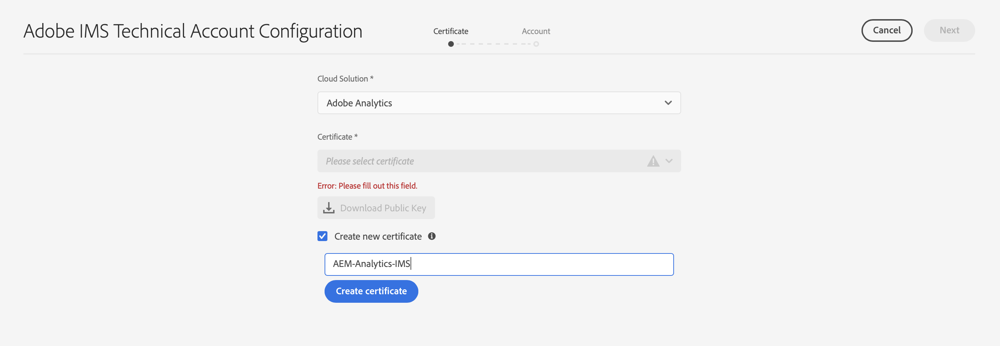
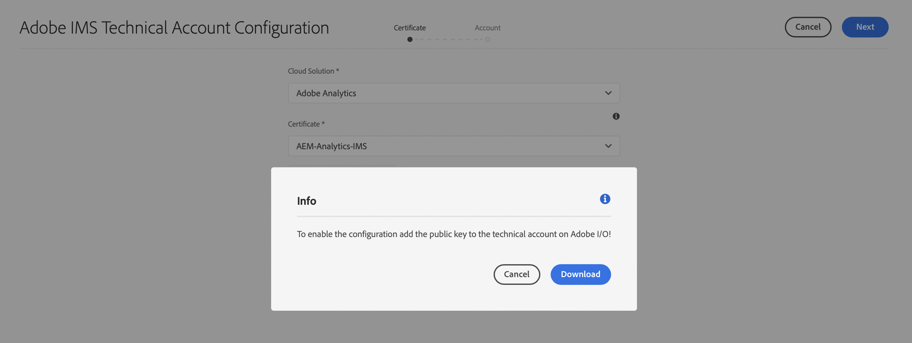
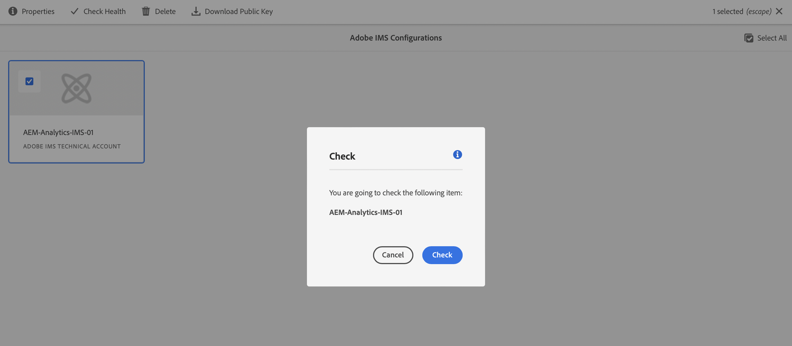

# 與Adobe Analytics整合時使用的IMS配置 {#ims-configuration-for-integration-with-adobe-analytics}

通過分析標準API將Adobe Experience Manager as a Cloud Service(AEMaaCS)與Adobe Analytics整合需要配置Adobe IMS(Identity Management系統)。 配置是通過Adobe開發者控制台實現的。

>[!NOTE]
> 
>This feature is available in the prerelease channel.
>
>查看 [預發行渠道文檔](https://experienceleague.adobe.com/docs/experience-manager-cloud-service/content/release-notes/prerelease.html#enable-prerelease) 有關如何為您的環境啟用該功能的資訊。

>[!NOTE]
>
>AEMaaCS 2022.2.0中新增了對Adobe Analytics StandardAPI 2.0的支援。此版本的API支援IMS驗證。
>
>The API selection is driven by the authentication method used for AEM/Analytics integration.
>
>進一步資訊也可在下 [遷移到2.0 API](https://developer.adobe.com/analytics-apis/docs/2.0/guides/migration/)。

## 必備條件 {#prerequisites}

開始此過程之前：

* [Adobe支援](https://helpx.adobe.com/tw/contact/enterprise-support.ec.html) 必須設定帳戶：

   * Adobe Console
   * Adobe Developer Console
   * Adobe Analytics
   * Adobe IMS(Identity Management系統)

* 您組織的系統管理員應使用該Admin Console將組織中所需的開發人員添加到相關的產品配置檔案中。

   * 這為特定開發人員提供了使用Adobe開發人員控制台啟用整合的權限。
   * For further details see [Manage Developers](https://helpx.adobe.com/enterprise/admin-guide.html/enterprise/using/manage-developers.ug.html).

## 配置IMS配置 — 生成公鑰 {#configuring-ims-generating-a-public-key}

配置的第一階段是在中建立IMS配置並AEM生成公鑰。

1. 開啟AEM **工具** 的子菜單。
1. 在 **安全** 節選 **Adobe IMS配置**。
1. 選擇 **建立** 開啟 **Adobe IMS技術帳戶配置**。
1. 使用下拉框 **雲配置**&#x200B;選中 **Adobe Analytics**。
1. Activate **Create new certificate** and enter a new alias.
1. 確認 **建立證書**。

   

1. 選擇 **下載** 或 **下載公鑰**)將檔案下載到本地驅動器，以便在 [配置IMS以與Adobe Analytics集AEM成](#configuring-ims-adobe-analytics-integration-with-aem)。

   >[!CAUTION]
   >
   >保持此配置開啟，當 [在中完成IMS配AEM置](#completing-the-ims-configuration-in-aem)。

   

## 配置IMS以與Adobe Analytics集AEM成 {#configuring-ims-adobe-analytics-integration-with-aem}

使用Adobe開發人員控制台，您需要與Adobe Analytics（供使用）建立項目(集AEM成)，然後分配所需的權限。

### Creating the Project {#creating-the-project}

開啟Adobe開發者控制台，以建立將使用以下功能的具有Adobe AnalyticsAEM的項目：

1. 開啟項目Adobe開發人員控制台：

   [https://developer.adobe.com/console/projects](https://developer.adobe.com/console/projects)

1. Any projects that you have will be shown. Select **Create New Project** - the location and usage will depend on:

   * If you do not have any project yet, **Create new project** will be center, bottom.
      
   * 如果您已經擁有現有項目，將列出並 **建立新項目** 右上。
      

1. Select **Add to Project** followed by **API**:

   

1. 選擇 **Adobe Analytics**，則 **下一個**:

   >[!NOTE]
   >
   >如果您訂閱了Adobe Analytics，但未看到列出，則應檢查 [先決條件](#prerequisites)。

   

1. Select **Service Account (JWT)** as the type of type of authentication, then continue with **Next**:

   

1. **Upload your public key**, and when complete, continue with **Next**:

   

1. 查看憑據，並繼續 **下一個**:

   

1. 選擇所需的產品配置檔案，然後繼續 **保存已配置的API**:

   

1. The configuration will be confirmed.

### 為整合分配權限 {#assigning-privileges-to-the-integration}

您現在必須為整合分配所需的權限：

1. 開啟Adobe **Admin Console**:

   * [https://adminconsole.adobe.com](https://adminconsole.adobe.com/)

1. Navigate to **Products** (top toolbar), then select **Adobe Analytics - &lt;*your-tenant-id*>** (from the left panel).
1. 選擇 **產品配置檔案**，然後從顯示的清單中找到所需的工作區。 For example, Default Workspace.
1. Select **API Credentials**, then the required integration configuration.
1. 選擇 **編輯器** 的 **產品角色**;而不是 **觀察者**。

## 為Adobe開發人員控制台整合項目儲存的詳細資訊 {#details-stored-for-the-ims-integration-project}

在Adobe開發者控制台 — 項目中，您可以看到所有整合項目的清單：

* [https://developer.adobe.com/console/projects](https://developer.adobe.com/console/projects)

選擇特定項目條目以顯示有關配置的詳細資訊。 這些包括：

* Project overview
* 分析
* 憑據
   * Service Account (JWT)
      * Credential details
      * 生成JWT
* APIS
   * 比如說Adobe Analytics

Some of these you will need to complete the integration of Adobe Analytics in AEM based on IMS.

## 在中完成IMS配AEM置 {#completing-the-ims-configuration-in-aem}

返回AEM後，您可以通過添加Analytics的IMS整合中的所需值來完成IMS配置：

1. 返回到 [IMS配置在中打AEM開](#configuring-ims-generating-a-public-key)。
1. 選擇 **下一個**。

1. 在這裡，你可以 [Adobe開發人員控制台中項目配置的詳細資訊](#details-stored-for-the-ims-integration-project):

   * **標題**:你的簡訊。
   * **授權伺服器**:從 `aud` 行 **負載** 如 `https://ims-na1.adobelogin.com` 在下面的示例中
   * **API密鑰**:從 **憑據** 的下界 [項目概述](#details-stored-for-the-ims-integration-project)
   * **Client Secret**: Generate this in the [Client Secret tab of the Service Account (JWT) section](#details-stored-for-the-ims-integration-project), and copy
   * **負載**:從 [生成「服務帳戶(JWT)」部分的JWT頁籤](#details-stored-for-the-ims-integration-project)

   

1. 確認 **建立**。

1. Your Adobe Analytics configuration will be shown in the AEM console.

   

## 確認IMS配置 {#confirming-the-ims-configuration}

要確認配置按預期運行，請執行以下操作：

1. 開啟:

   * `https://localhost<port>/libs/cq/adobeims-configuration/content/configurations.html`

   例如：

   * `https://localhost:4502/libs/cq/adobeims-configuration/content/configurations.html`

1. 選擇您的配置。
1. 選擇 **檢查運行狀況** ，然後 **檢查**。

   

1. 如果成功，您將看到一條確認消息。

## 完成與Adobe Analytics的整合 {#complete-the-integration-with-adobe-analytics}

您現在可以使用此IMS配置來完成 [與Adobe Analytics](/help/sites-cloud/integrating/integrating-adobe-analytics.md)。

<!--
## Configuring the Adobe Analytics Cloud Service {#configuring-the-adobe-analytics-cloud-service}

The configuration can now be referenced for a Cloud Service to use the Analytics Standard API:

1. Open the **Tools** menu. Then, within the **Cloud Services** section, select **Legacy Cloud Services**.
1. Scroll down to **Adobe Analytics** and select **Configure now**.

   The **Create Configuration** dialog will open.

1. Enter a **Title** and, if you want, a **Name** (if left blank this will be generated from the title).

   You can also select the required template (if more than one is available).

1. Confirm with **Create**.

   The **Edit Component** dialog will open.

1. Enter the details in the **Analytics Settings** tab:

    * **Authentication**: IMS

    * **IMS Configuration**: select the name of the IMS Configuration

1. Click **Connect to Analytics** to initialize the connection with Adobe Analytics.

   If the connection is successful, the message **Connection successful** is displayed.

1. Select **OK** on the message.

1. Complete other parameters as required, followed by **OK** on the dialog to confirm the configuration.

1. You can now proceed to [Adding an Analytics Framework](/help/sites-administering/adobeanalytics-connect.md) to configure parameters that will be sent to Adobe Analytics. 
-->
