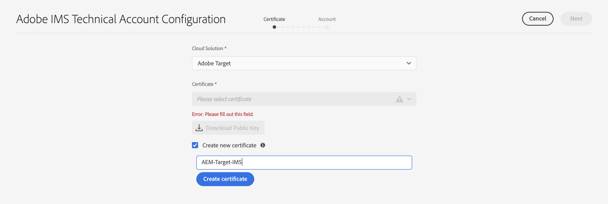
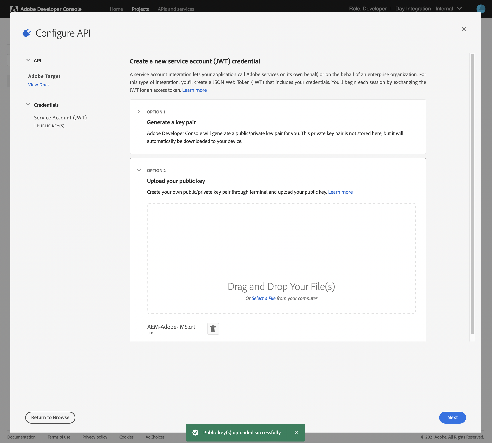

# 與Adobe Target整合時使用的IMS配置{#ims-configuration-for-integration-with-adobe-target}

通過目標標AEM準API與Adobe Target進行整合需要配置Adobe IMS(Identity Management系統)。 配置是通過Adobe開發者控制台實現的。

>[!NOTE]
>
>AEMaaCS中新增了對Adobe Target標準API的支援。 目標標準API使用IMS驗證。
>
>API選擇由用於AEM/Target整合的驗證方法驅動。

## 必備條件 {#prerequisites}

開始此過程之前：

* [Adobe支援](https://helpx.adobe.com/tw/contact/enterprise-support.ec.html) 必須設定帳戶：

   * Adobe控制台
   * Adobe開發人員控制台
   * Adobe Target
   * Adobe IMS(Identity Management系統)

* 您組織的系統管理員應使用該Admin Console將組織中所需的開發人員添加到相關的產品配置檔案中。

   * 這為特定開發人員提供了使用Adobe開發人員控制台啟用整合的權限。
   * 有關詳細資訊，請參閱 [管理開發人員](https://helpx.adobe.com/enterprise/admin-guide.html/enterprise/using/manage-developers.ug.html)。

## 配置IMS配置 — 生成公鑰 {#configuring-an-ims-configuration-generating-a-public-key}

配置的第一階段是在中建立IMS配置並AEM生成公鑰。

1. 開啟AEM **工具** 的子菜單。
1. 在 **安全** 節選 **Adobe IMS配置**。
1. 選擇 **建立** 開啟 **Adobe IMS技術帳戶配置**。
1. 使用下拉框 **雲配置**&#x200B;選中 **Adobe Target**。
1. 激活 **建立新證書** 並輸入新別名。
1. 確認 **建立證書**。

   

1. 選擇 **下載** 或 **下載公鑰**)將檔案下載到本地驅動器，以便在 [配置IMS以與Adobe Target集AEM成](#configuring-ims-adobe-target-integration-with-aem)。

   >[!CAUTION]
   >
   >保持此配置開啟，當 [在中完成IMS配AEM置](#completing-the-ims-configuration-in-aem)。

   

## 配置IMS以與Adobe Target集AEM成 {#configuring-ims-adobe-target-integration-with-aem}

Adobe開發人員控制台項目（整合）,AEM與Adobe Target一起使用，然後分配所需權限。

### 建立項目 {#creating-the-project}

開啟Adobe開發者控制台，以建立將使用以下功能的具有Adobe TargetAEM的項目：

1. 開啟項目Adobe開發人員控制台：

   [https://developer.adobe.com/console/projects](https://developer.adobe.com/console/projects)

1. 將顯示您擁有的任何項目。 選擇 **建立新項目**  — 地點和用途取決於：

   * 如果你還沒有項目， **建立新項目** 中間，底部。
      
   * 如果您已經擁有現有項目，將列出並 **建立新項目** 右上。
      

1. 選擇 **添加到項目** 後跟 **API**:

   

1. 選擇 **Adobe Target**，則 **下一個**:

   >[!NOTE]
   >
   >如果您訂閱了Adobe Target，但未看到列出，則應檢查 [先決條件](#prerequisites)。

   

1. **上載公鑰**，完成後繼續 **下一個**:

   

1. 查看憑據，並繼續 **下一個**:

   

1. 選擇所需的產品配置檔案，然後繼續 **保存已配置的API**:

   >[!NOTE]
   >
   >顯示的產品配置檔案取決於您是否具有：
   >
   >* Adobe Target標準 — 僅 **預設工作區** 可用
   >* Adobe Target高級版 — 列出所有可用工作區，如下所示

   

1. 將確認建立。

<!--
1. The creation will be confirmed, you can now **Continue to integration details**; these are needed for [Completing the IMS Configuration in AEM](#completing-the-ims-configuration-in-aem).

   
-->

<!-- could not verify - only saw Adobe Target Classic -->

### 為整合分配權限 {#assigning-privileges-to-the-integration}

您現在必須為整合分配所需的權限：

1. 開啟Adobe **Admin Console**:

   * [https://adminconsole.adobe.com](https://adminconsole.adobe.com/)

1. 導航到 **產品** （頂部工具欄），然後選擇 **Adobe Target- &lt;*您的租戶ID*>** （從左面板）。
1. 選擇 **產品配置檔案**，然後從顯示的清單中找到所需的工作區。 例如，預設工作區。
1. 選擇 **API憑據**，然後是所需的整合配置。
1. 選擇 **編輯器** 的 **產品角色**;而不是 **觀察者**。

## 為Adobe開發人員控制台整合項目儲存的詳細資訊 {#details-stored-for-the-ims-integration-project}

在Adobe開發者控制台項目控制台中，您可以看到所有整合項目的清單：

* [https://developer.adobe.com/console/projects](https://developer.adobe.com/console/projects)

選擇 **視圖** （位於特定項目條目的右側）以顯示有關配置的詳細資訊。 這些包括：

* 項目概述
* 分析
* 憑據
   * 服務帳戶(JWT)
      * 憑據詳細資訊
      * 生成JWT
* APIS
   * 比如說Adobe Target

其中一些需要完成Adobe Target在基於IMSAEM的整合。

## 在中完成IMS配AEM置 {#completing-the-ims-configuration-in-aem}

返回AEM後，您可以通過添加目標IMS整合中的所需值來完成IMS配置：

1. 返回到 [IMS配置在中打AEM開](#configuring-an-ims-configuration-generating-a-public-key)。
1. 選擇 **下一個**。

1. 在這裡，你可以 [詳細資訊，請參閱Adobe開發者控制台中的項目配置](#details-stored-for-the-ims-integration-project):

   * **標題**:你的簡訊。
   * **授權伺服器**:從 `aud` 行 **負載** 如 `https://ims-na1.adobelogin.com` 在下面的示例中
   * **API密鑰**:從項目中複製 [概述](#details-stored-for-the-ims-integration-project) 節
   * **客戶端密碼**:在項目中生成此項 [概述](#details-stored-for-the-ims-integration-project) 和複製
   * **負載**:從 [生成JWT](#details-stored-for-the-ims-integration-project) 節

   

1. 確認 **建立**。

1. 您的Adobe Target配置將顯示在控AEM制台中。

   

## 確認IMS配置 {#confirming-the-ims-configuration}

要確認配置按預期運行，請執行以下操作：

1. 開啟:

   * `https://localhost<port>/libs/cq/adobeims-configuration/content/configurations.html`

   例如：

   * `https://localhost:4502/libs/cq/adobeims-configuration/content/configurations.html`

1. 選擇您的配置。
1. 選擇 **檢查運行狀況** ，然後 **檢查**。

   

1. 如果成功，您將看到一條確認消息。

## 完成與Adobe Target的整合 {#complete-the-integration-with-adobe-target}

您現在可以使用此IMS配置來完成 [與Adobe Target](/help/sites-cloud/integrating/integrating-adobe-target.md)。

<!--

## Configuring the Adobe Target Cloud Service {#configuring-the-adobe-target-cloud-service}

The configuration can now be referenced for a Cloud Service to use the Target Standard API:

1. Open the **Tools** menu. Then, within the **Cloud Services** section, select **Legacy Cloud Services**.
1. Scroll down to **Adobe Target** and select **Configure now**.

   The **Create Configuration** dialog will open.

1. Enter a **Title** and, if you want, a **Name** (if left blank this will be generated from the title).

   You can also select the required template (if more than one is available).

1. Confirm with **Create**.

   The **Edit Component** dialog will open.

1. Enter the details in the **Adobe Target Settings** tab:

    * **Authentication**: IMS

    * **Client Code**: See the [Tenant ID and Client Code](#tenant-client) section.

    * **Tenant ID**: the Adobe IMS Tenant ID. See also the [Tenant ID and Client Code](#tenant-client) section.

      >[!NOTE]
      >
      >For IMS this value needs to be taken from Target itself. You can log into Target and extract the Tenant ID from the URL.
      >
      >For example, if the URL is:
      >
      >`https://experience.adobe.com/#/@yourtenantid/target/activities`
      >
      >Then you would use `yourtenantid`.

    * **IMS Configuration**: select the name of the IMS Configuration

    * **API Type**: REST

    * **A4T Analytics Cloud Configuration**: Select the Analytics cloud configuration that is used for target activity goals and metrics. You need this if you are using Adobe Analytics as the reporting source when targeting content.   

      <!--
      If you do not see your cloud configuration, see note in [Configuring A4T Analytics Cloud Configuration](/help/sites-administering/target-configuring.md#configuring-a-t-analytics-cloud-configuration).
      -- >

    * **Use accurate targeting**: By default this check box is selected. If selected, the cloud service configuration will wait for the context to load before loading content. See note that follows.

    * **Synchronize segments from Adobe Target**: Select this option to download segments that are defined in Target to use them in AEM. You must select this option when the API Type property is REST, because inline segments are not supported and you always need to use segments from Target. (Note that the AEM term of 'segment' is equivalent to the Target 'audience'.)

    * **Client library**: Select whether you want the AT.js client library, or mbox.js (deprecated).

    * **Use Tag Management System to deliver client library**: Use DTM (deprecated), Adobe Launch or any other tag management system.

    * **Custom AT.js**: Leave blank if you checked the Tag Management box or to use the default AT.js. Alternatively upload your custom AT.js. Only appears if you have selected AT.js.

   <!--
   >[!NOTE]
   >
   >[Configuration of a Cloud Service to use the Target Classic API](/help/sites-administering/target-configuring.md#manually-integrating-with-adobe-target) has been deprecated (uses the Adobe Recommendations Settings tab).
   -- >

1. Click **Connect to Adobe Target** to initialize the connection with Adobe Target.

   If the connection is successful, the message **Connection successful** is displayed.

1. Select **OK** on the message, followed by **OK** on the dialog to confirm the configuration.

1. You can now proceed to [Adding a Target Framework](/help/sites-administering/target-configuring.md#adding-a-target-framework) to configure ContextHub or ClientContext parameters that will be sent to Target. Note this may not be required for exporting AEM Experience Fragments to Target.

### Tenant ID and Client Code {#tenant-client}

With [Adobe Experience Manager as a Cloud Service](/help/release-notes/release-notes-cloud/release-notes-current.md), the Client Code field had been added to the Target configuration window.

When configuring the Tenant ID and Client Code fields, please be aware of that for most customers, the **Tenant ID** and the **Client Code** are the same. This means that both fields contain the same information and are identical. Make sure you enter the Tenant ID in both fields.

>[!NOTE]
>
>For legacy purposes, you can also enter different values in the Tenant ID and the Client Code fields.

In both cases, be aware that:

* By default, the Client Code (if added first) will also be automatically copied into the Tenant ID field.
* You have the option to change the default Tenant ID set.
* Accordingly, the backend calls to Target will be based on the **Tenant ID** and the client side calls to Target will be based on the **Client Code**.

As stated previously, the default case is the most common for AEM as a Cloud Service. Either way, make sure **both** fields contain the correct information depending on your requirements.

>[!NOTE]
>
> If you want to change an existing Target Configuration:
>
> 1. Re-enter the Tenant ID.
> 2. Re-connect to Target.
> 3. Save the configuration.
-->
