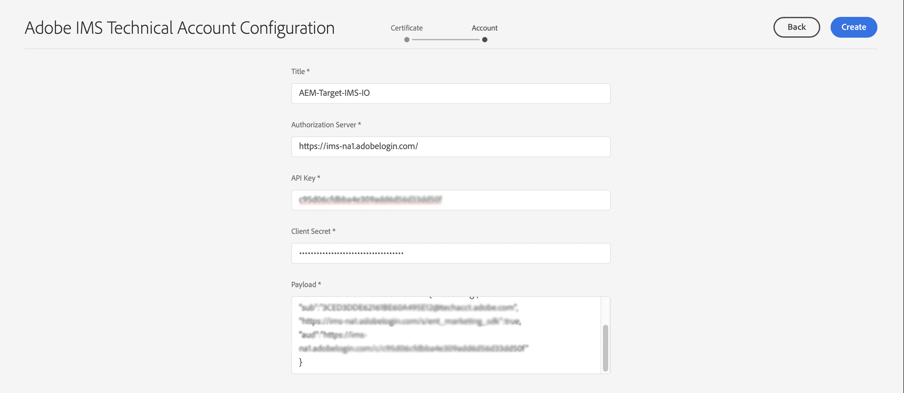
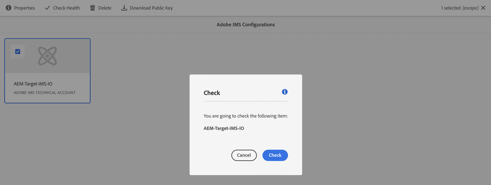

# IMS設定，以在與Adobe Target整合時使用{#ims-configuration-for-integration-with-adobe-target}

AEM透過Target Standard API與Adobe Target整合需要設定Adobe IMS(Identity Management系統)。 設定是透過Adobe Developer主控台實現。

>[!NOTE]
>
>AEMaaCS新增了對Adobe Target Standard API的支援。 Target Standard API使用IMS驗證。
>
>API選取由用於AEM/Target整合的驗證方法驅動。

## 必備條件 {#prerequisites}

開始此過程之前：

* [Adobe支援](https://helpx.adobe.com/tw/contact/enterprise-support.ec.html) 必須為您配置帳戶：

   * Adobe主控台
   * Adobe Developer Console
   * Adobe Target和
   * Adobe IMS(Identity Management系統)

* 貴組織的系統管理員應使用Admin Console，將貴組織中所需的開發人員新增至相關的產品設定檔。

   * 這可為特定開發人員提供使用Adobe Developer主控台啟用整合的權限。
   * 如需詳細資訊，請參閱 [管理開發人員](https://helpx.adobe.com/enterprise/admin-guide.html/enterprise/using/manage-developers.ug.html).

## 設定IMS設定 — 產生公開金鑰 {#configuring-an-ims-configuration-generating-a-public-key}

設定的第一階段是在AEM中建立IMS設定並產生公開金鑰。

1. 在AEM中開啟 **工具** 功能表。
1. 在 **安全性** 節選 **Adobe IMS設定**.
1. 選擇 **建立** 開啟 **Adobe IMS技術帳戶設定**.
1. 使用下拉式清單 **雲端設定**，選取 **Adobe Target**.
1. 啟動 **建立新憑證** 並輸入新別名。
1. 確認為 **建立憑證**.

   

1. 選擇 **下載** (或 **下載公開金鑰**)將檔案下載到本機磁碟，以便在 [設定IMS for Adobe Target與AEM整合](#configuring-ims-adobe-target-integration-with-aem).

   >[!CAUTION]
   >
   >請保持此設定開啟，當 [在AEM中完成IMS設定](#completing-the-ims-configuration-in-aem).

   

## 為Adobe Target設定IMS與AEM整合 {#configuring-ims-adobe-target-integration-with-aem}

Adobe Developer Console專案（整合）與AEM將使用的Adobe Target，然後指派所需的權限。

### 建立專案 {#creating-the-project}

開啟Adobe Developer Console以使用AEM將使用的Adobe Target建立專案：

1. 開啟專案的Adobe Developer Console:

   [https://developer.adobe.com/console/projects](https://developer.adobe.com/console/projects)

1. 將顯示您擁有的任何專案。 選擇 **建立新專案**  — 位置和使用取決於：

   * 如果您尚未建立任何專案， **建立新專案** 中間，底部。
      
   * 如果您已有現有專案，則會列出 **建立新專案** 右上角。
      

1. 選擇 **新增至專案** 後跟 **API**:

   

1. 選擇 **Adobe Target**，然後 **下一個**:

   >[!NOTE]
   >
   >如果您已訂閱Adobe Target，但未看到其列出，則應檢查 [必要條件](#prerequisites).

   

1. **上傳您的公開金鑰**，完成時，繼續 **下一個**:

   

1. 查看憑據，然後繼續 **下一個**:

   

1. 選取所需的產品設定檔，然後繼續 **儲存已設定的API**:

   >[!NOTE]
   >
   >顯示的產品設定檔視您是否具備：
   >
   >* Adobe Target Standard — 僅 **預設工作區** 可用
   >* Adobe Target Premium — 會列出所有可用的工作區，如下所示

   

1. 建立將得到確認。

<!--
1. The creation will be confirmed, you can now **Continue to integration details**; these are needed for [Completing the IMS Configuration in AEM](#completing-the-ims-configuration-in-aem).

   
-->

<!-- could not verify - only saw Adobe Target Classic -->

### 為整合指派權限 {#assigning-privileges-to-the-integration}

您現在必須將必要的權限指派給整合：

1. 開啟Adobe **Admin Console**:

   * [https://adminconsole.adobe.com](https://adminconsole.adobe.com/)

1. 導覽至 **產品** （頂端工具列），然後選取 **Adobe Target - &lt;*your-tenant-id*>** （從左側面板）。
1. 選擇 **產品設定檔**，則會從顯示的清單中取得您所需的工作區。 例如，預設工作區。
1. 選擇 **API憑證**，然後是必要的整合設定。
1. 選擇 **編輯器** 作為 **產品角色**;而非 **觀察者**.

## 儲存於Adobe Developer主控台整合專案的詳細資料 {#details-stored-for-the-ims-integration-project}

從Adobe Developer Console專案主控台，您可以看到所有整合專案的清單：

* [https://developer.adobe.com/console/projects](https://developer.adobe.com/console/projects)

選擇 **檢視** （位於特定專案項目的右側），以顯示有關設定的詳細資訊。 這些包括：

* 專案概述
* 分析
* 憑證
   * 服務帳戶(JWT)
      * 憑據詳細資訊
      * 產生JWT
* API
   * 例如，Adobe Target

其中部分作業需要根據IMS完成Adobe Target與AEM的整合。

## 在AEM中完成IMS設定 {#completing-the-ims-configuration-in-aem}

回到AEM後，您就可以從Target的IMS整合新增必要值，以完成IMS設定：

1. 返回 [在AEM中開啟IMS設定](#configuring-an-ims-configuration-generating-a-public-key).
1. 選擇 **下一個**.

1. 您可以在此處使用 [Adobe Developer Console中專案設定的詳細資訊](#details-stored-for-the-ims-integration-project):

   * **標題**:你的簡訊。
   * **授權伺服器**:複製/貼上 `aud` 行 **裝載** 以下章節為例， `https://ims-na1.adobelogin.com` 在以下範例中
   * **API金鑰**:從專案複製此內容 [概述](#details-stored-for-the-ims-integration-project) 節
   * **用戶端密碼**:在專案中產生此項目 [概述](#details-stored-for-the-ims-integration-project) 節，並複製
   * **裝載**:從 [產生JWT](#details-stored-for-the-ims-integration-project) 節

   

1. 確認為 **建立**.

1. 您的Adobe Target設定會顯示在AEM主控台中。

   

## 確認IMS設定 {#confirming-the-ims-configuration}

若要確認設定如預期般運作：

1. 開啟:

   * `https://localhost<port>/libs/cq/adobeims-configuration/content/configurations.html`

   例如：

   * `https://localhost:4502/libs/cq/adobeims-configuration/content/configurations.html`

1. 選取您的設定。
1. 選擇 **檢查運行狀況** ，後面 **檢查**.

   

1. 如果成功，您會看到確認訊息。

## 完成與Adobe Target的整合 {#complete-the-integration-with-adobe-target}

您現在可以使用此IMS設定來完成 [整合Adobe Target](/help/sites-cloud/integrating/integrating-adobe-target.md).

<!--

## Configuring the Adobe Target Cloud Service {#configuring-the-adobe-target-cloud-service}

The configuration can now be referenced for a Cloud Service to use the Target Standard API:

1. Open the **Tools** menu. Then, within the **Cloud Services** section, select **Legacy Cloud Services**.
1. Scroll down to **Adobe Target** and select **Configure now**.

   The **Create Configuration** dialog will open.

1. Enter a **Title** and, if you want, a **Name** (if left blank this will be generated from the title).

   You can also select the required template (if more than one is available).

1. Confirm with **Create**.

   The **Edit Component** dialog will open.

1. Enter the details in the **Adobe Target Settings** tab:

    * **Authentication**: IMS

    * **Client Code**: See the [Tenant ID and Client Code](#tenant-client) section.

    * **Tenant ID**: the Adobe IMS Tenant ID. See also the [Tenant ID and Client Code](#tenant-client) section.

      >[!NOTE]
      >
      >For IMS this value needs to be taken from Target itself. You can log into Target and extract the Tenant ID from the URL.
      >
      >For example, if the URL is:
      >
      >`https://experience.adobe.com/#/@yourtenantid/target/activities`
      >
      >Then you would use `yourtenantid`.

    * **IMS Configuration**: select the name of the IMS Configuration

    * **API Type**: REST

    * **A4T Analytics Cloud Configuration**: Select the Analytics cloud configuration that is used for target activity goals and metrics. You need this if you are using Adobe Analytics as the reporting source when targeting content.   

      <!--
      If you do not see your cloud configuration, see note in [Configuring A4T Analytics Cloud Configuration](/help/sites-administering/target-configuring.md#configuring-a-t-analytics-cloud-configuration).
      -- >

    * **Use accurate targeting**: By default this check box is selected. If selected, the cloud service configuration will wait for the context to load before loading content. See note that follows.

    * **Synchronize segments from Adobe Target**: Select this option to download segments that are defined in Target to use them in AEM. You must select this option when the API Type property is REST, because inline segments are not supported and you always need to use segments from Target. (Note that the AEM term of 'segment' is equivalent to the Target 'audience'.)

    * **Client library**: Select whether you want the AT.js client library, or mbox.js (deprecated).

    * **Use Tag Management System to deliver client library**: Use DTM (deprecated), Adobe Launch or any other tag management system.

    * **Custom AT.js**: Leave blank if you checked the Tag Management box or to use the default AT.js. Alternatively upload your custom AT.js. Only appears if you have selected AT.js.

   <!--
   >[!NOTE]
   >
   >[Configuration of a Cloud Service to use the Target Classic API](/help/sites-administering/target-configuring.md#manually-integrating-with-adobe-target) has been deprecated (uses the Adobe Recommendations Settings tab).
   -- >

1. Click **Connect to Adobe Target** to initialize the connection with Adobe Target.

   If the connection is successful, the message **Connection successful** is displayed.

1. Select **OK** on the message, followed by **OK** on the dialog to confirm the configuration.

1. You can now proceed to [Adding a Target Framework](/help/sites-administering/target-configuring.md#adding-a-target-framework) to configure ContextHub or ClientContext parameters that will be sent to Target. Note this may not be required for exporting AEM Experience Fragments to Target.

### Tenant ID and Client Code {#tenant-client}

With [Adobe Experience Manager as a Cloud Service](/help/release-notes/release-notes-cloud/release-notes-current.md), the Client Code field had been added to the Target configuration window.

When configuring the Tenant ID and Client Code fields, please be aware of that for most customers, the **Tenant ID** and the **Client Code** are the same. This means that both fields contain the same information and are identical. Make sure you enter the Tenant ID in both fields.

>[!NOTE]
>
>For legacy purposes, you can also enter different values in the Tenant ID and the Client Code fields.

In both cases, be aware that:

* By default, the Client Code (if added first) will also be automatically copied into the Tenant ID field.
* You have the option to change the default Tenant ID set.
* Accordingly, the backend calls to Target will be based on the **Tenant ID** and the client side calls to Target will be based on the **Client Code**.

As stated previously, the default case is the most common for AEM as a Cloud Service. Either way, make sure **both** fields contain the correct information depending on your requirements.

>[!NOTE]
>
> If you want to change an existing Target Configuration:
>
> 1. Re-enter the Tenant ID.
> 2. Re-connect to Target.
> 3. Save the configuration.
-->
