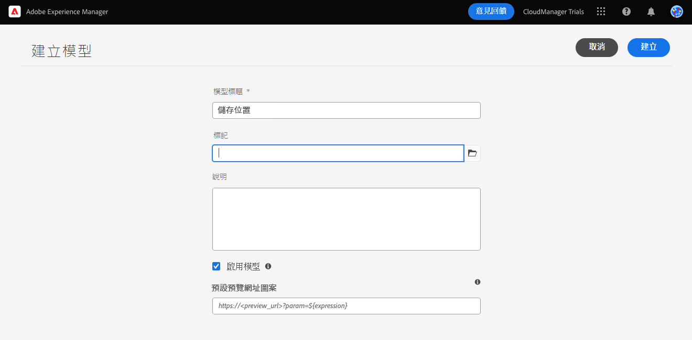
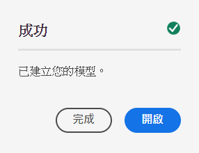
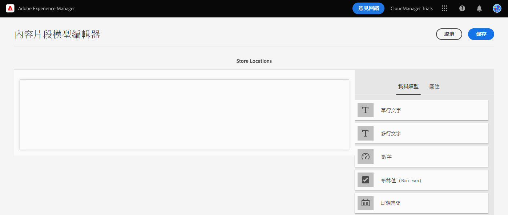
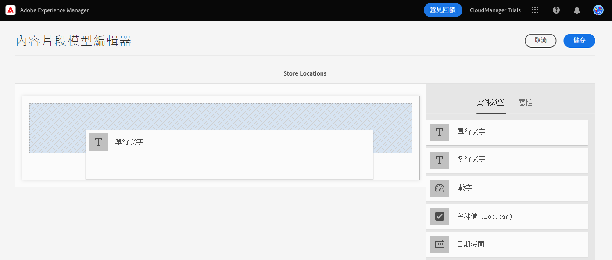
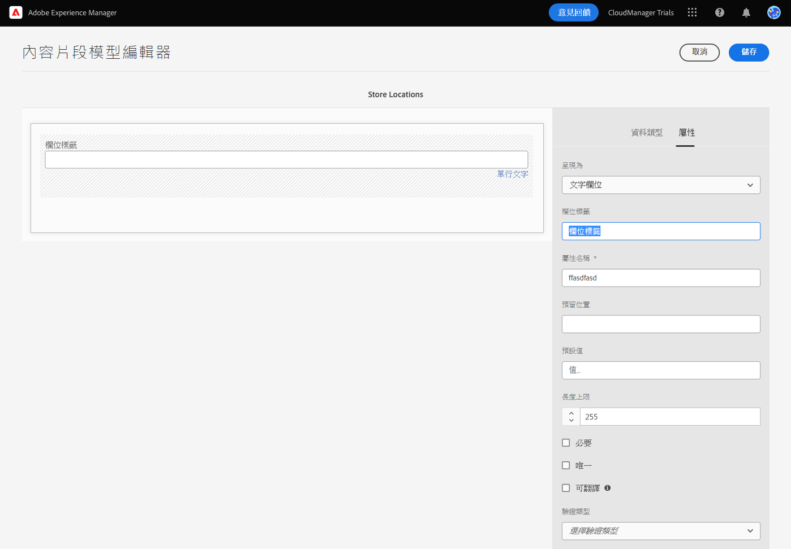
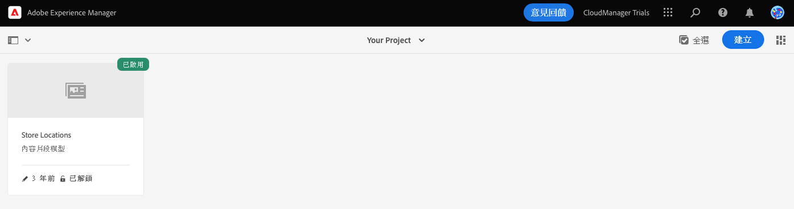

# 為您的應用程式建立內容結構 {#content-structure}

內容片段允許您設計、建立、規劃和發佈每頁自主的內容。使用這些內容片段，您可以準備適用於多個位置和多個管理使用的內容，非常適合 Headless 傳送。內容片段模式是用來定義此內容的結構，並且是您需要建立的第一件事，以便管理您的 Headless 內容。

為了幫助您了解如何完成這一點，AEM 試用版這項模組將以快速互動式導覽帶您完成整個過程，先建立模式然後新增其結構。本文件可用作產品內導覽的補充資料，內容說明相同的步驟並在需要時連至其他資源。

>[!CONTEXTUALHELP]
>id="aemcloud_sites_trial_admin_content_fragments_overview_guide_br_test"
>title="啟動模型編輯器"
>abstract="建立內容片段模型首先在模型管理工作流程中建立模型項目，然後使用內容片段模型編輯器將結構元素新增至模型項目。  按一下以下，在新索引標籤中啟動功能，並依照本學習檔案建立您的第一個內容片段。"

>[!CONTEXTUALHELP]
>id="aemcloud_sites_trial_admin_content_fragments_overview_guide_newline_test"
>title="啟動模型編輯器"
>abstract="建立內容片段模型首先在模型管理工作流程中建立模型項目，然後使用內容片段模型編輯器將結構元素新增至模型項目。\n\n按一下以下內容，在新頁簽中啟動功能，然後按照本學習文檔建立第一個內容片段。"

>[!CONTEXTUALHELP]
>id="aemcloud_sites_trial_admin_content_fragments_overview"
>title="建立應用程式的內容結構"
>abstract="您會依照我們一系列互動式指南操作時，將學習建立結構（也稱為內容片段模型），此結構可作為所有無頭式內容的基礎。"

## 內容片段模式控制台 {#content-fragment-model-console}

您將從內容片段模式控制台開始。您可以將內容片段模式控制台視為您的模式資料庫。您使用該控制台來建立新的模式並管理現有模式。您的控制台一開始是空的，所以我們來建立一個新模式！

如果您希望在應用程式內用指南之外自行導覽到內容片段模式，您可以使用頁面左上方的 Adobe 圖示找到。如此將可開啟 AEM 的全域導覽模式。 從這裡，您要選擇「**工具**」標籤，然後選擇「**一般** -> **內容片段模式**」。

>[!TIP]
>
>如果您想深入了解有關 AEM 導覽的資訊，請參閱本文件的「[其他資源部分](#additional-resources)」，了解有關 AEM 基本處理的更多資訊。

## 建立一個模式 {#create-model}

進入內容片段模式控制台後，您可以建立一個新模式來代表您自己的 Headless 內容。

1. 在內容片段控制台的螢幕右上方，點選「**建立**」按鈕，即可開始建立一個內容片段模式。

1. 建立模式精靈會啟動，然後會引導您建立內容片段模式。

   

   提供必填資訊。

   * **模式標題** - 這是模式的簡短描述，通常會指明其用途。
   * **啟用模式** - 此選項依預設為勾選，必須勾選才能在後根據此模式建立內容片段。

   您還可以選擇為模式新增更長的「**說明**」和「**標籤**」，以便進行模式分類並在內容片段模式控制台中讓您的用戶以後能區分不同模式。

   >[!TIP]
   >
   >如果您有興趣了解標籤如何整理您的內容，請參閱本文件的「[其他資源部分](#additional-resources)」，了解在 AEM 新增標籤的更多資訊。

1. 必填欄位填入後，在左上方按一下「**建立**」以建立模式。

1. 「**成功** 」對話框會確認模式已建立。

   

1. 在使用模式之前，您還需要定義其資料結構。在對話框按一下「**開啟**」，即可開啟並繼續定義模式。

## 新增欄位至模式 {#configure-model}

內容片段模式基本上是您內容片段的結構。例如，模式會定義模式包含的欄位/資料類型。

使用內容片段模式編輯器，您可以使用拖放介面為內容片段模式定義欄位。

1. 在螢幕右側，從「**資料類型**」面板中拖動一個欄位，並將其放到您的內容片段模式上。有多種資料類型可供選擇，例如單行文字、多行文字、數字和對其他片段的引用。

   

   >[!TIP]
   >
   >如果您想了解更多有關可用資料類型，請參閱本文件的「[其他資源部分](#additional-resources)」，取得詳細的內容片段模式文件。

1. 放好資料類型後，「**資料類型**」欄會自動變更為「**屬性**」標籤，您可以在其中定義您剛剛放好的詳細資料類型。

   

   模式的屬性可能包括欄位名稱、欄位類型、欄位長度 (若必填) 等。

1. 使用所選資料類型的「**屬性**」標籤來定義屬性，例如預設值、最大長度、是否為必填欄位等。

   >[!TIP]
   >
   >如果您想了解更多有關可用屬性，請參閱本文件的「[其他資源部分](#additional-resources)」，取得詳細的內容片段模式文件。

1. 新增內容片段模式所需的所有欄位後，在視窗右上方按一下「**儲存**」。

1. 這將儲存模式並返回至內容片段模式控制台，您可以在其中新增更多模式。

## 您已經了解如何建立內容片段模式 {#conclusion}

在本模組中，您已了解如何建立內容片段模式來代表的結 Headless 資料的結構。首先，您建立了模式，然後以資料類型及其相關屬性來填入模式，進而定義 Headless 內容的結構。

現在您有了自己的內容片段模式，您可以使用該模式來建立內容片段。「[建立新內容](create-content.md)」模組有詳細資訊，讓您了解如何使用新內容片段模式來建立 Headless 內容。

您可以在導覽列右上方按一下「**解決方案**」按鈕，並選取 **Experience Manager**，即可返回您的試用版主畫面。

## 其他資源 {#additional-resources}

有關內容片段和 AEM 的更多資訊，請考慮查看此附加文件。

* [基本處理](/help/sites-cloud/authoring/getting-started/basic-handling.md) - 有關新用戶如何導覽和使用 AEM 的文件
* [使用標籤](/help/sites-cloud/authoring/features/tags.md) - 有關如何在 AEM 中使用標籤來整理內容的文件
* [內容片段](/help/assets/content-fragments/content-fragments.md) - 內容片段概觀和內容片段完整文件的連結
* [內容片段模式](/help/assets/content-fragments/content-fragments-models.md) - 關於內容片段模式的完整文件
* [內容片段模式 - 資料類型](/help/assets/content-fragments/content-fragments-models.md#data-types) - 內容片段模式可用的各種資料類型詳細資訊
* [內容片段模式 - 屬性](/help/assets/content-fragments/content-fragments-models.md#data-types) - 內容片段模式資料類型可用的各種屬性詳細資訊
