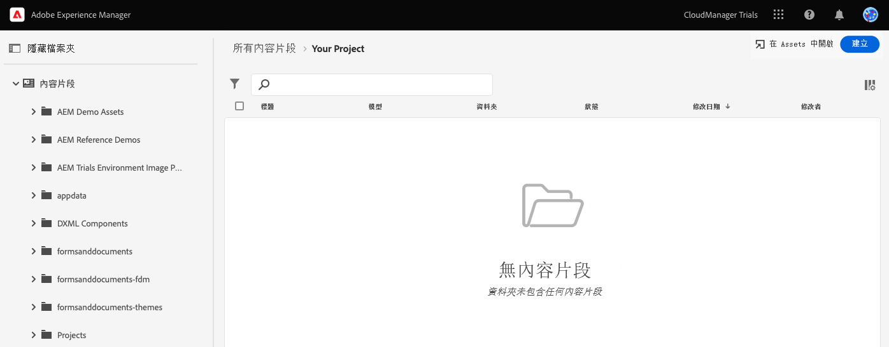
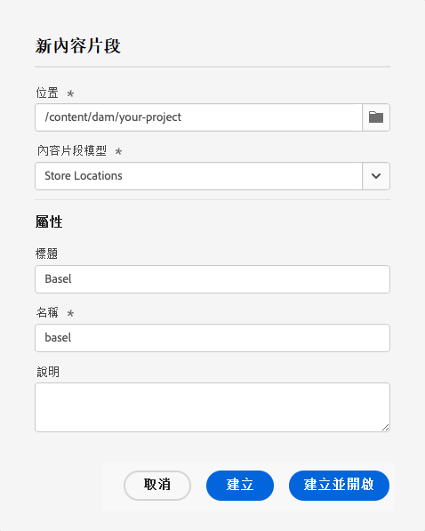
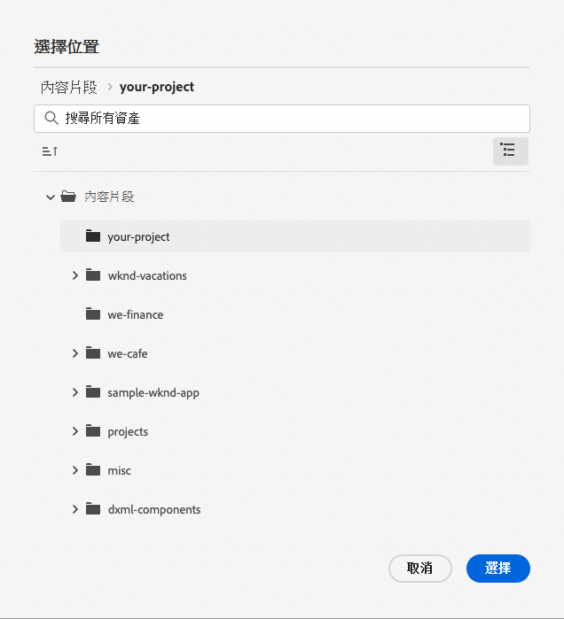
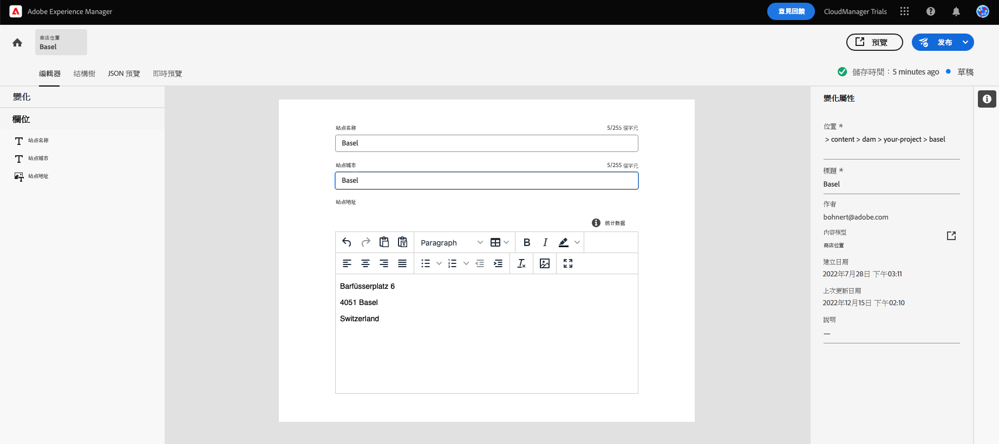
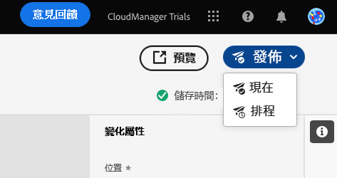
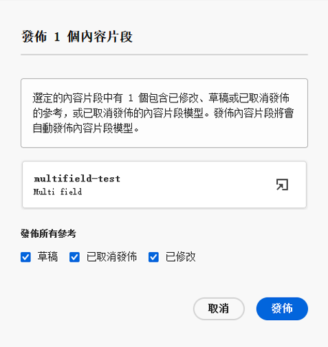
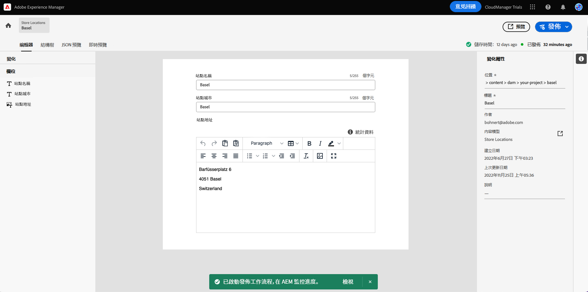
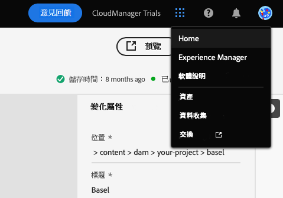

# 建立 Headless 內容 {#create-content}

依照產品提供的學習模式，了解如何使用[您先前建立的內容片段模式](content-structure.md)來建立可用來編寫頁面的內容，或作為 Headless 內容的依據。 本文件可用作互動式導覽的補充資料，內容說明相同的步驟並在需要時連至其他資源。

>[!CONTEXTUALHELP]
>id="aemcloud_sites_trial_admin_content_fragments_create_content"
>title="建立新內容"
>abstract="使用您在單元 1 建立的模型當作基礎，您將了解如何建立可用於編寫頁面或作為 Headless 內容基礎的內容。"

>[!CONTEXTUALHELP]
>id="aemcloud_sites_trial_admin_content_fragments_create_content_guide"
>title="啟動內容片段主控台"
>abstract="在AEM無頭式CMS中，「內容片段」是符合預先定義結構（稱為「內容片段模型」）的所有內容片段。 在此逐步說明中，您將學習如何為內容片段模型建立內容。  按一下底下，在新的索引標籤中啟動該功能，然後依照此學習文件的說明建立您的第一個內容片段。"
>additional-url="https://video.tv.adobe.com/v/328618" text="簡介視頻的佔位符"
>additional-url="https://experienceleague.adobe.com/docs/experience-manager-cloud-service/assets/home_c1.png" text="影片縮圖：新增內容 — 成功方式"

## 內容片段 {#introduction}

在 AEM as a Cloud Service 中，內容片段是以內容片段模式所定義的結構為依據形成的許多小段 Headless 內容。 您可以從內容片段控制台為起頭來建立自己的內容片段。 您可以將內容片段控制台視為您的 Headless 內容資料庫。 您使用該控制台來建立新的內容片段並管理現有片段。 您的控制台一開始是空的，所以我們來建立一個新片段！

如果您希望在應用程式內用指南之外自行導覽到內容片段控制台，您可以使用頁面左上方的 Adobe 圖示找到。 如此將可開啟 AEM 的全域導覽模式。 從這裡，您需選擇「**導覽**」標籤，然後選擇「**內容片段**」。

>[!TIP]
>
>如果您想深入了解有關 AEM 導覽的資訊，請參閱本文件的「[其他資源部分](#additional-resources)」，了解有關 AEM 基本處理的更多資訊。

## 建立內容片段 {#create-fragment}

內容片段代表您的 Headless 內容。 但是這類內容只能據預定義的內容結構來建立。 您先前建立的內容片段模式可作為該結構使用。

1. 在控制台右上方，點選或按一下「**建立**」按鈕，即可開啟「**新內容片段**」對話框，並開始建立一個新的內容片段。

   

1. 如果您是依應用程式內用指南進行，「**地點**」欄將自動填入。

   1. 如果您不是依照指南進行，請使用路徑瀏覽器來選取您的專案檔案夾。

   1. 在「**新內容片段**」對話框中，點選或按一下「**選擇地點**」按鈕 (看起來像檔案夾的圖示，位於「**地點**」欄位內)。

      
   * 或者，在按一下「**建立**」之前，另外在內容片段控制台的左側導覽面板中選取路徑。

1. 在「**內容片段模式**」下拉式清單中，選取您先前在下拉式清單建立的內容片段模式。

1. 為內容片段新增&#x200B;**標題**。

1. 點選或按一下「**建立並開啟**」。

## 內容片段編輯器 {#edit-fragment}

儲存新的內容片段後，內容片段編輯器將開啟；您可以在編輯器中提供片段的實際內容。

1. 編輯器會顯示您在所選模式中定義的欄位。 您可以在此處編輯內容，以完成您的內容片段。 您的進度會自動儲存。

   

1. 如果您的內容片段模式有很多欄位，您可以使用編輯器左側的 「**變數**」面板快速前往任何欄位。 有錯誤的欄位將標記在此處。

1. 為了讓內容片段可供外部應用程式使用，您需要將內容片段發佈。 在編輯器右上方，點選或按一下「**發佈**」按鈕。

1. 從下拉式清單中選取「**立即**」。 您還可以安排在以後發佈。

   

   >[!TIP]
   >
   >如果您想深入了解有關在 AEM 發佈內容的資訊，請參閱本文件的「[其他資源部分](#additional-resources)」，了解有關發佈內容的更多資訊。

1. AEM 會自動執行參考檢查，以確保為您的內容片段發佈所有必要的資源。 在這種情況下，您還需要發佈您建立的模式。 點選或按一下「**發佈**」。

   

1. 這項內容發佈會在橫幅中確認。

   

## 您已經了解如何建立內容片段！ {#conclusion}

在本模式中，您已了解如何根據先前建立的模式建立內容片段。 這就是內容作者建立結構化 Headless 內容的方式。

您的內容已建立並發佈，現在，您可以透過 AEM 的 API 以 Graph QL 擷取該內容。 您將在「[透過 GraphQL API 擷取內容](extract-content.md)」中了解關於這一點

您可以在導覽列右上方按一下「**解決方案**」按鈕，並選取 **Experience Manager**，即可返回您的試用版主畫面。

## 其他資源 {#additional-resources}

有關內容片段和 AEM 的更多資訊，請考慮查看此附加文件。

* [基本處理](/help/sites-cloud/authoring/getting-started/basic-handling.md) - 有關新用戶如何導覽和使用 AEM 的文件
* [管理內容片段 - 發布和引用](/help/assets/content-fragments/content-fragments-managing.md#publishing-and-referencing-a-fragment) - 有關如何在 AEM 中發佈內容的詳細資訊
* [內容片段](/help/assets/content-fragments/content-fragments.md) - 內容片段概觀和內容片段完整文件的連結
* [管理內容片段](/help/assets/content-fragments/content-fragments-managing.md) - 如何建立和管理內容片段
