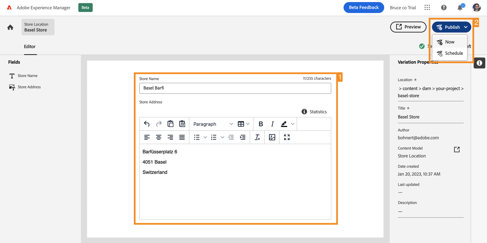

# 建立 Headless 內容 {#create-content}

>[!CONTEXTUALHELP]
>id="aemcloud_sites_trial_admin_content_fragments_create_content"
>title="建立新內容"
>abstract="使用您在上一個單元中建立的模式，您將瞭解如何建立可用於編寫頁面或作為 Headless 內容基礎的內容。"

>[!CONTEXTUALHELP]
>id="aemcloud_sites_trial_admin_content_fragments_create_content_guide"
>title="啟動內容片段主控台"
>abstract="建立可在您的應用程式和網站上無縫執行的高品質一致內容，能帶來出色的客戶體驗。本單元將引導您建立您的第一個內容片段，以說明如何實際操作。  點選下方按鈕，在新標籤中啟動此單元，然後按照本指南進行操作。"

>[!CONTEXTUALHELP]
>id="aemcloud_sites_trial_admin_content_fragments_create_content_guide_footer"
>title="做得好！在本單元中，您已瞭解如何根據先前建立的模式建立內容片段。您現在瞭解內容團隊能如何建立和管理應用程式和網站的內容，不受開發週期的限制。"
>abstract=""

## 建立內容片段 {#create-fragment}

內容片段代表您的 Headless 內容，且以預先定義的結構為基礎，稱為內容片段模式。將內容片段主控台視為您的 Headless 內容資料庫。 使用該控制台來建立新的內容片段並管理現有片段。

1. 在主控台右上方，點選或按一下&#x200B;**建立**&#x200B;按鈕。

1. **新內容片段**&#x200B;對話框隨即開啟，您可以在此處開始建立新的內容片段。**位置**&#x200B;會自動填入新內容的儲存位置。

1. 在&#x200B;**內容片段模式**&#x200B;下拉式清單中，選取您先前建立的內容片段模式。

1. 為內容片段新增&#x200B;**標題**。

1. 點選或按一下&#x200B;**建立並開啟**。

## 新增內容至您的內容片段 {#add-content}

儲存並開啟新內容片段後，內容片段編輯器將在新標籤上開啟。您可以在此處新增新片段的內容。

1. 內容片段編輯器會顯示您在所選模式中定義的欄位。 您可以在此處向每個欄位新增內容，以完成您的內容片段。 您的進度會自動儲存。

1. 新增完內容後，點選或按一下編輯器右上角的&#x200B;**發佈**&#x200B;按鈕。這可讓您的內容片段供外部應用程式使用。

1. 從下拉式清單中選取&#x200B;**立即**。您還可以安排在以後發佈。

   

1. **發佈內容片段**&#x200B;對話框隨即出現。AEM 會自動執行參考檢查，以確保為您的內容片段發佈所有必要的資源。 在這種情況下，您還需要發佈您建立的模式。 點選或按一下&#x200B;**發佈**。

   

1. 這項內容發佈會在橫幅中確認。

您的內容已發佈，並準備好作為內容片段傳送到您的應用程式或網站。
