# 在範例 React 應用程式中自訂內容 {#customize-app}

Headless 內容的 AEM 試用版有一個預先載入的簡單 React 應用程式，可展示 Headless 內容。 在本模式中，您將了解如何預覽該應用程式，以及透過變換影像並為其建立可購物機會來修改該內容。

應用程式本身是根據內容片段的結構來建立。 使用 AEM 中的內容片段編輯器，您可以修改您的應用程式內容。 為了幫助您了解如何完成這一點，AEM 試用版這項模式將以快速互動式導覽帶您完成整個過程。 本文件可用作互動式導覽的補充資料，內容說明相同的步驟並在需要時連至其他資源。

## 內容片段編輯器 {#fragment-editor}

您會從此範例應用程式的內容片段編輯器開始。

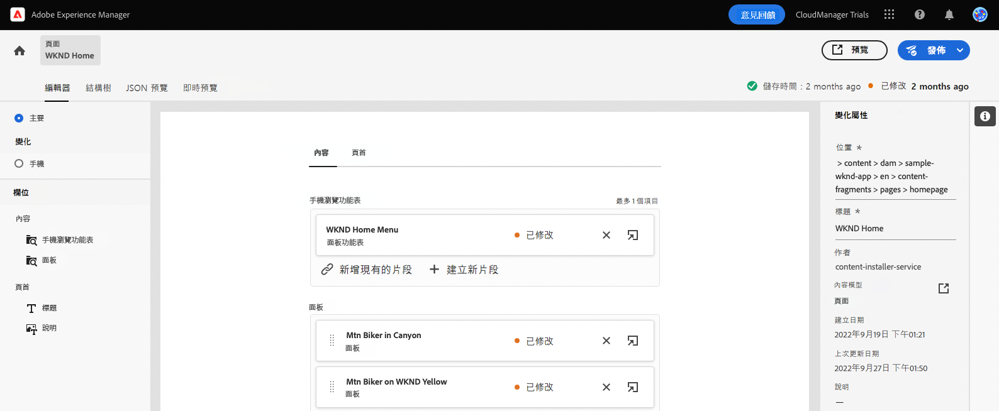

如果您希望在應用程式內用指南之外自行導覽到內容片段編輯器，您可以使用頁面左上方的 Adobe 圖示找到。 如此將可開啟 AEM 的全域導覽模式。 從這裡，您需選擇「**導覽**」標籤，然後選擇「**內容片段**」。

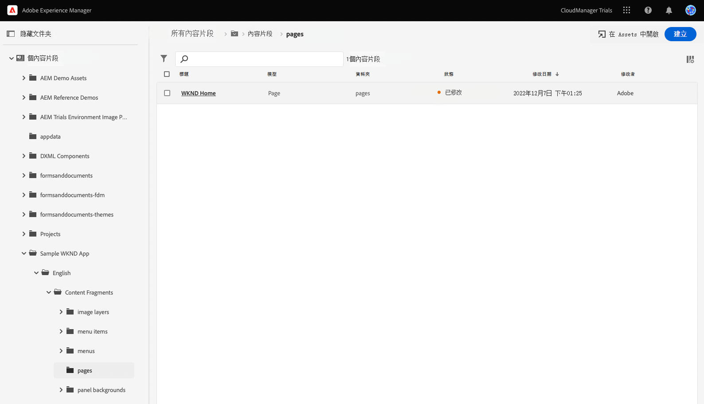

如此將可開啟內容片段控制台。 從那裡，您可以使用左側面板中的內容樹導覽至應用程式內容的位置。 此時，前往「**內容片段** -> **範例 WKND 應用程式** -> **英文** -> **內容片段** -> **頁面**」下。

在內容樹右側控制台中，點選或按一下顯示的「**WKND 首頁**」頁面片段，即可啟動應用程式內容的編輯器。

>[!TIP]
>
>如果您想深入了解有關 AEM 導覽的資訊，請參閱本文件的「[其他資源部分](#additional-resources)」，了解有關 AEM 基本處理的更多資訊。

## 預覽應用程式 {#preview}

在開始修訂應用程式以前，請先透過預覽目前狀態來熟悉內容。 在編輯器畫面的右上方，點選或按一下「**預覽**」按鈕。

示範應用程式會在新標籤中開啟。

該應用程式本身是一個簡單的電子商務應用程式，適用於在 React 實施的虛構 WKND 戶外生活方式品牌。 按一下不同內容，以導覽範例內容。

返回內容片段編輯器的標籤，並且繼續。

## 在應用程式中編輯文字 {#edit-app}

如前所述，應用程式本身是由內容片段組成。 這些片段在結構中會連結在一起，並建立為應用程式。

內容片段編輯器會將應用程式的基本版面顯示為頁面。 此頁面是一個內容片段，本身就是其他片段的集合。 **面版**&#x200B;代表應用程式的不同頁面，每個頁面都是自己的內容片段。 透過修訂這些片段，您可以變更應用程式的內容。

1. 點選或按一下「**峽谷中的越野騎士**」，在「**面版**」區段中。

   

1. 編輯器會開啟越野車的標題面板。 每個面板是由不同內容層組成，代表應用程式頁面中的不同內容。

   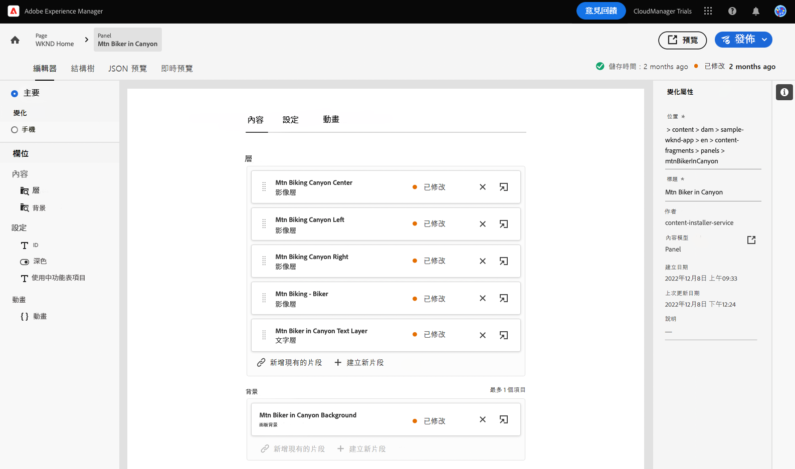

1. 選取文字層「**峽谷中的越野騎士文字層**」。 這將在編輯器中開啟內容層的詳細資訊。 該內容層是由多個內容片段組成。

   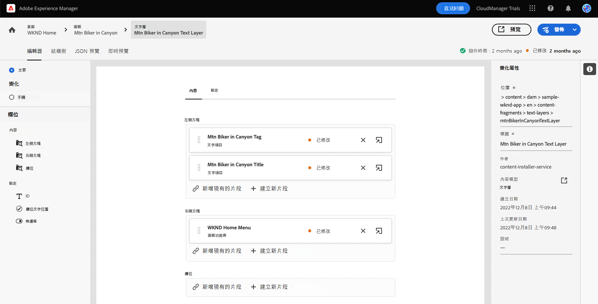

1. 選取「**峽谷中的越野騎士標題**」文字項目。 這將開啟「內容片段」編輯器，顯示該片段內容並允許您修改內容。

   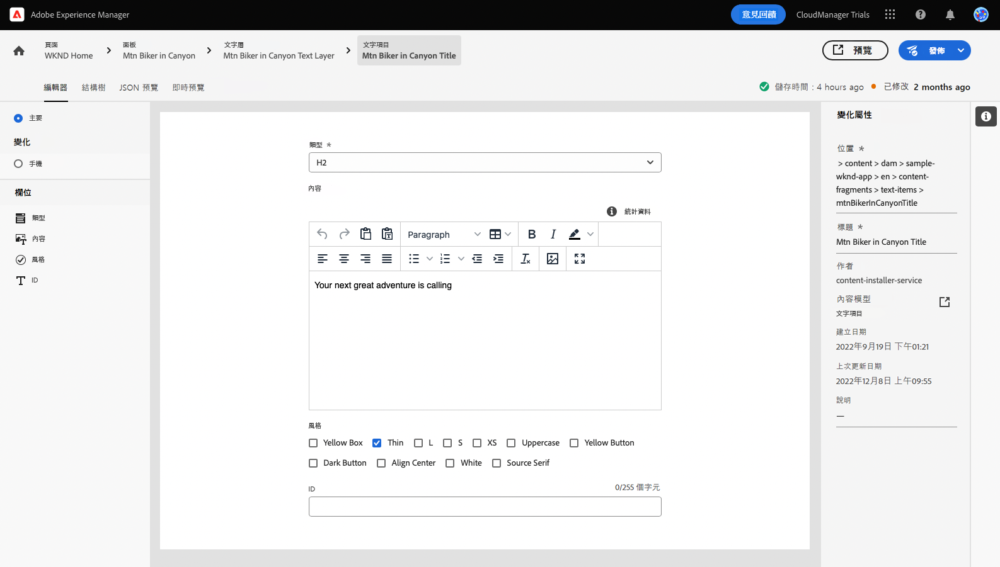

1. 將文字從 `Your next great adventure is calling` 變更為 `Choose your own adventure`。 此變更會由編輯器自動儲存。

1. 按一下 「預覽」，可查看您的變更。 示範應用程式會在新標籤中開啟。

   

返回內容片段編輯器的標籤，並且繼續進行此模式。

## 變更應用程式的主要影像 {#change-image}

現在您已經修改了應用程式中的一些文字，請嘗試變更應用程式的主要影像。 首先，您需要找到該內容。

編輯器左上方的階層連結顯示您在內容層次結構中的位置。

1. 在階層連結中，點選或按一下「**峽谷中的越野騎士**」，可返回該頁面。

   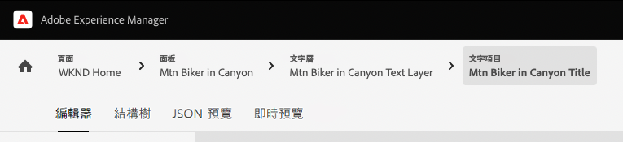

1. 返回該面板及應用程式的不同內容層。 這些內容層不僅僅代表文字內容，還代表您應用程式中的所有內容。因此，您也可以使用內容片段編輯器來變換影像。

   

1. 選取「**騎越野車 - 騎士**」影像層。 這將開啟「內容片段」編輯器，顯示該片段內容並允許您修改內容。

   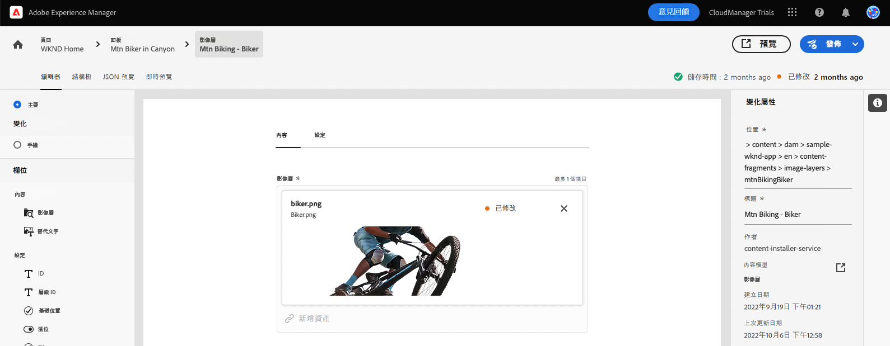

1. 點選或按一下 **X** 以刪除騎士的影像。 影像會消失且編輯器會顯示錯誤，因為影像是此內容片段模式所需的資料。

   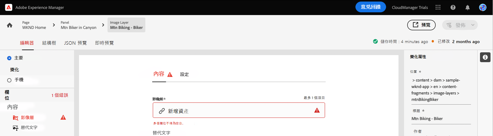

1. 點選或按一下「**新增資產**」 ，並在「**範例-wknd-應用程式** > **英文** > **影像-檔案**」中找到黃色騎士的影像。 使用「**選取資產**」對話框左側的樹狀視圖，即可導覽內容層次結構。

   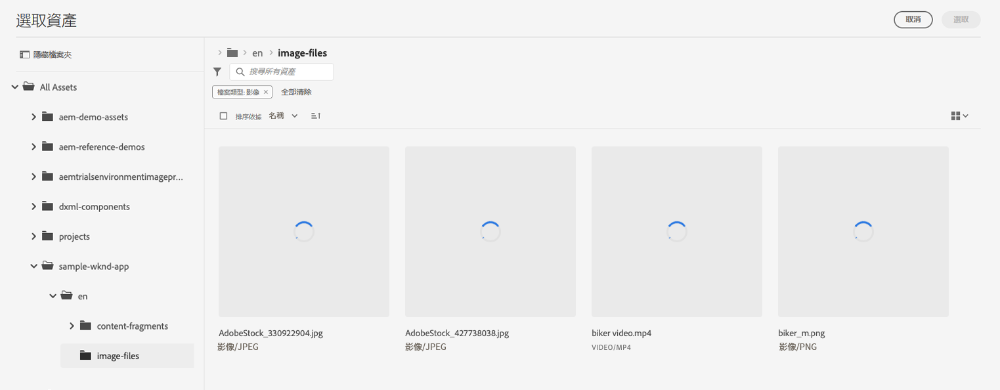

1. 篩選文字 `yellow`。 使用「**搜尋全部資產**」欄位 (在「**選取資產**」視窗上方) 並搜尋該影像。 輸入搜尋文字，然後按一下輸入鍵或返回進行搜尋。

   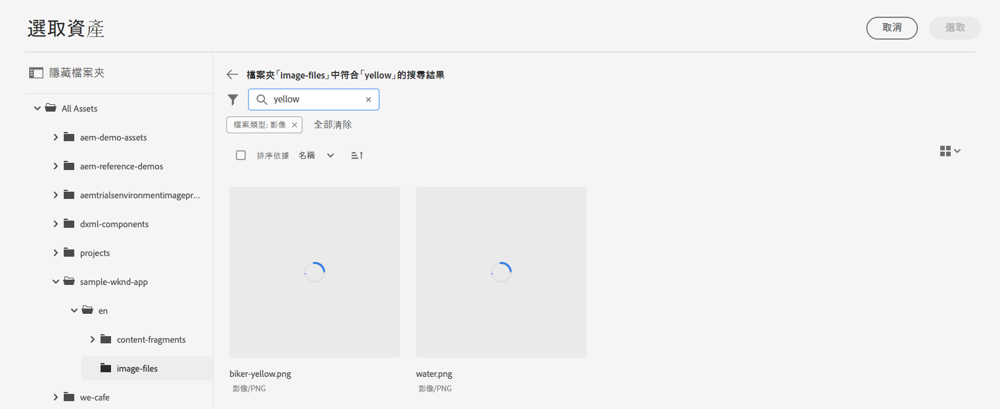

1. 點選或按一下以選取 `biker-yellow.png` 影像，然後點選或按一下「**選取**」。

   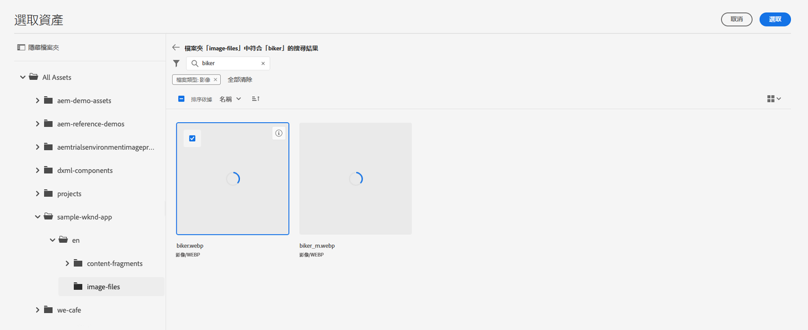

1. 騎士影像已更換為所選影像。 編輯器會自動儲存這些變更。

   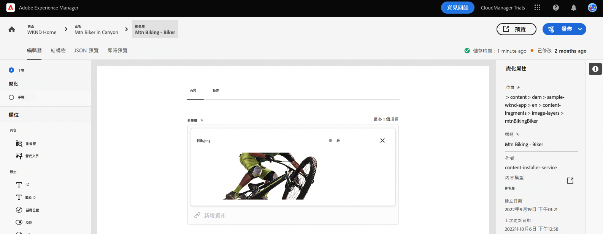

## 建立一個「可購物機會」 {#create-moment}

現在您已經更新騎士影像，您可以為騎士的黃色短褲加入一個「可購物機會」。

1. 首先返回頁面片段的內容片段編輯器。 編輯器左上方的階層連結顯示您在內容層次結構中的位置。 在階層連結中，點選或按一下「**WKND 首頁**」，可返回該頁面。

   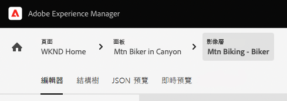

1. 選取「**在 WKND 黃色的越野騎士**」面板。

   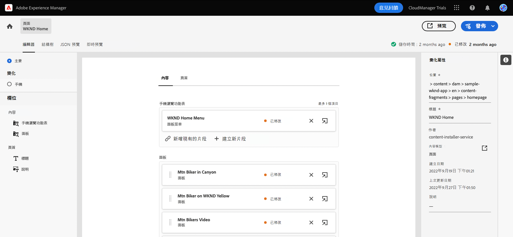

1. 您現在可以看到構成騎士影像的圖層。 透過選取「**越野騎士 - 可選購**」圖層，為騎車人的黃色短褲加入一個「可購物機會」。

   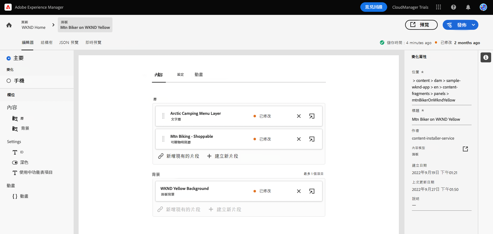

1. 為了建立一個可購物機會，您必須建立一個新的內容片段來代表該時刻。 單選或按一下「**+ 建立新片段**」按鈕，為騎士短褲加入可購物機會。

   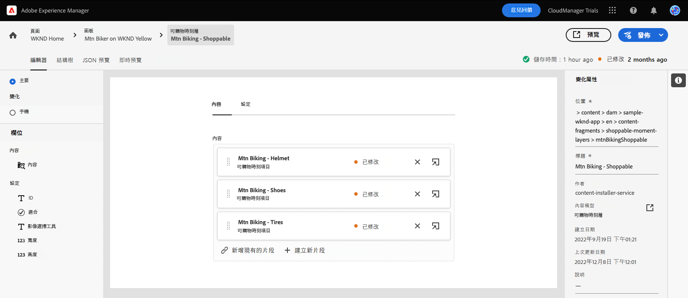

1. 因為內容片段代表結構化的 Headless 資料，所以無論何時建立內容片段，您都必須首先選擇一個可作為依據的模式。 選取「**可購機會商品**」模式 (從「**內容片段模式**」下拉式清單)。

   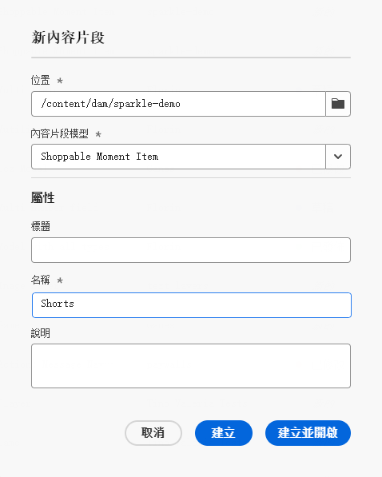

1. 為這個全新可購物機會的內容片段取一個代表名稱。 例如，在欄位中輸入 `Shorts` (在「**名稱**」欄位中)。

   

1. 點選或按一下「**建立並開啟**」。

1. 編輯器會為您的新內容片段開啟。
   * 在「**文字**」欄位內為可購物機會命名，例如命名為 `Yellow shorts`。
   * 設定一個 X 和 Y，為可購物機會設定覆蓋的位置。
      * **X**: `-18`
      * **Y**: `-28`
   * 編輯器會自動儲存片段的變更

   

1. 點選或按一下「**預覽**」，測試此定位並根據需要進行調整。

   

## 您已經了解如何自訂範例 React 應用程式！ {#conclusion}

在本模式中，您已了解如何自訂範例 React 應用程式。 首先，您了解如何編輯現有文字。 然後，將影像變換為該圖像的另一個執行個體。 最後，您已看到如何建立可購物機會商品並進行定位。

請務必查看「[其他資源部分](#additional-resources)」，了解使用 AEM 及其內容片段的其他資源。

如果您想了解如何為自訂應用程式建立可用的內容片段和 Headless 內容，您可以先開始查看模組[「為您的應用程式建立內容結構」。](content-structure.md)

您可以在導覽列右上方按一下「**解決方案**」按鈕，並選取 **Experience Manager**，即可返回您的試用版主畫面。

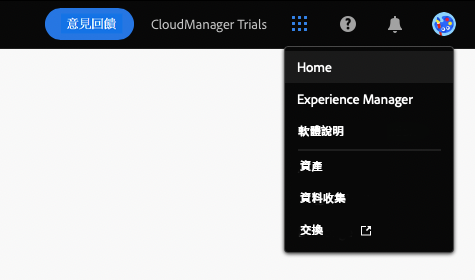

## 其他資源 {#additional-resources}

有關內容片段和 AEM 的更多資訊，請考慮查看此附加文件。

* [內容片段模式](/help/assets/content-fragments/content-fragments-models.md) - 關於內容片段模式的完整文件
* [內容片段](/help/assets/content-fragments/content-fragments.md) - 內容片段概觀和內容片段完整文件的連結
* [基本處理](/help/sites-cloud/authoring/getting-started/basic-handling.md) - 有關新用戶如何導覽和使用 AEM 的文件
