# 通過 GraphQL API 擷取內容 {#extract-content}

到目前為止，在 AEM 試用版 Headless 內容，您已經[建立自己的內容片段模式](content-structure.md)，並建立您自己的 Headless 內容作為[內容片段。](create-content.md)您現在了解如何將內容片段和 GraphQL API 用作 Headless 內容管理系統並交付您的內容。

GraphQL 提供查詢式的 API，允許外部客戶端應用程式使用單一 API 呼叫，以便查詢 AEM 所需的內容。

首先，您將了解如何執行兩種不同類型的查詢：**清單** 和 **byPath** 查詢。 然後，您將了解如何從您先前建立的內容片段擷取內容。 本文件可用作互動式導覽的補充資料，內容說明相同的步驟並在需要時連至其他資源。

>[!TIP]
>
>如果您想了解有關 GraphQL API 的更多詳細資訊，請參閱本模組最後的「[其他資源部分](#additional-resources)」，了解 GraphQL API 指南。

## GraphQL Explorer {#graphql-explorer}

您先從 GraphQL Explorer 開始。 在這裡，您可以建立和執行對 Headless 內容的查詢。

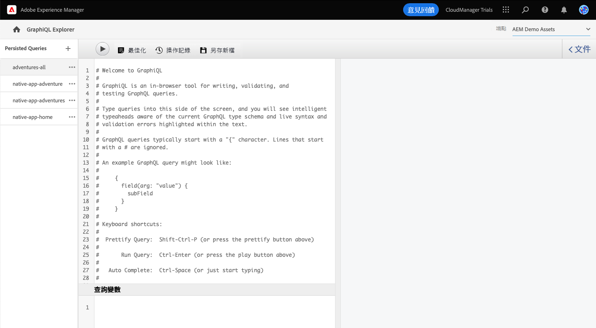

如果您希望在應用程式內用指南之外自行導覽到 GraphQL Explorer，您可以使用頁面左上方的 Adobe 圖示找到。 如此將可開啟 AEM 的全域導覽模式。從這裡，您要選擇「**工具**」標籤，然後選擇「**一般** -> **GraphQL 查詢編輯器**」。

>[!TIP]
>
>如果您想深入了解有關 AEM 導覽的資訊，請參閱本文件的「[其他資源部分](#additional-resources)」，了解有關 AEM 基本處理的更多資訊。

AEM 試用版附有一個與內容預先載入的端點，您可以從中擷取內容以進行測試。

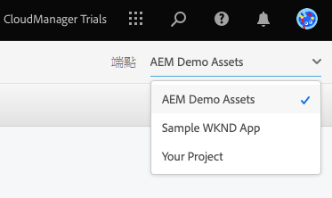

選取「**AEM 示範資產**」端點 (從編輯器右上方的「**端點**」下拉式清單中選取，如果還未選取)。

## 複製並執行一個清單查詢 {#list-query}

先從簡單的清單查詢開始，以便了解 AEM as a Cloud Service 的 GraphQL API 如何運作。 此清單查範例將返回使用特定內容片段模式的所有內容清單。 詳細目錄和類別頁面通常使用這種查詢格式。

1. 複製下列程式碼片段。

   ```text
   {
       adventureList {
         items {
            _path
            adventureTitle
            adventurePrice
            adventureTripLength
            adventurePrimaryImage {
              ... on ImageRef {
               _path
               mimeType
               width
               height
             }
           }
         }
      }
    }
   ```

1. 然後，貼上複製的程式碼，以之取代查詢編輯器中的現有內容。

   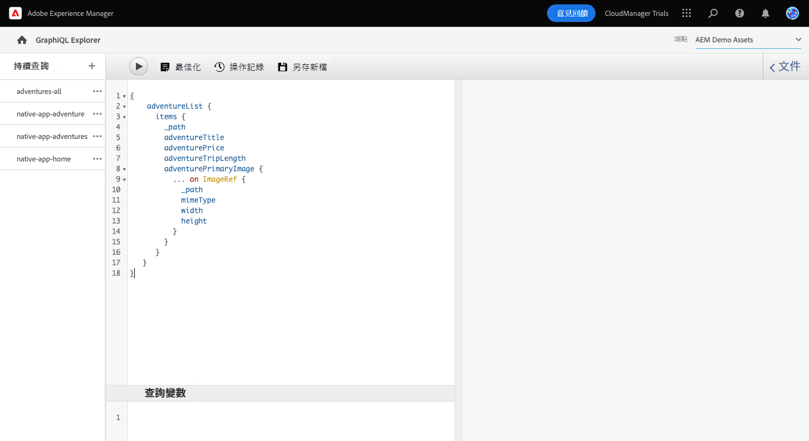

1. 貼上後，在查詢編輯器左上方按一下「**播放**」按鈕以執行查詢。

1. 一旦查詢執行成功，結果將顯示在右側面板中 (在查詢編輯器旁邊)。 如果查詢不正確，右側面板中會出現錯誤。

   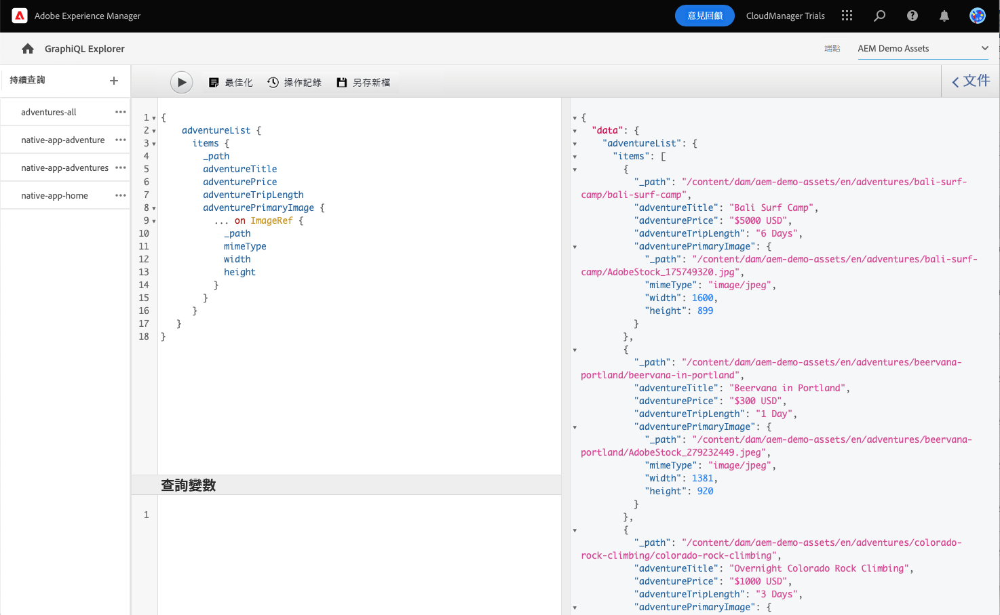

您剛剛驗證了所有內容片段完整清單的清單查詢。 此過程有助於確保查詢的回應符合您應用程式的預期，且結果會說明您的應用程式和網站將如何擷取在 AEM 建立的內容。

您的內容需要出現的不同頻道和平台現在可以使用此查詢或類似查詢來擷取您的 Headless 內容。

## 複製並執行一個 byPath 查詢 {#bypath-query}

執行 byPath 查詢可讓您擷取特定內容片段的資產。 產品詳細資訊頁面，以及著重在通常需要這類查詢的一組特定內容頁面。

1. 複製下列程式碼片段。

   ```text
    {
     adventureByPath(
       _path: "/content/dam/aem-demo-assets/en/adventures/bali-surf-camp/bali-surf-camp"
     ) {
       item {
         _path
         adventureTitle
         adventureDescription {
           json
         }
         adventurePrimaryImage {
           ... on ImageRef {
             _path
             width
             height
           }
         }
       }
     }
   }
   ```

1. 然後，貼上複製的程式碼，以之取代查詢編輯器中的現有內容。

   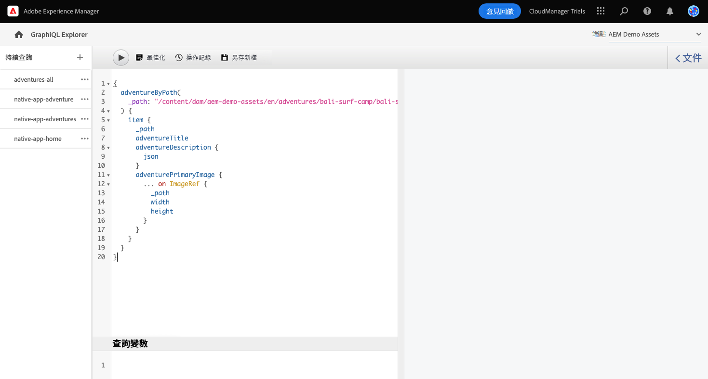

1. 貼上後，在查詢編輯器左上方按一下「**播放**」按鈕以執行查詢。

1. 一旦查詢執行成功，結果將顯示在右側面板中 (在查詢編輯器旁邊)。 如果查詢不正確，右側面板中會出現錯誤。

1. 一旦查詢執行成功，結果將顯示在右側面板中 (在查詢編輯器旁邊)。 如果查詢不正確，右側面板中會出現錯誤。

   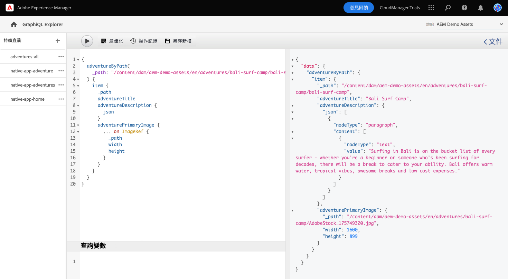

您剛剛驗證了所有內容片段完整清單的清單查詢。 此過程有助於確保查詢的回應符合您應用程式的預期，且結果會說明您的應用程式和網站將如何擷取在 AEM 建立的內容。

您的內容需要出現的不同頻道和平台現在可以使用此查詢或類似查詢來擷取您的 Headless 內容。

## 對您自己的內容進行查詢 {#own-queries}

您現在已經進行了兩種主要類型的查詢，您已準備好為自己建立的內容設定和執行查詢。

1. 若要針對您自己的內容片段進行查詢，請將端點從「**AEM 示範資產**」資料夾變更為「**您的專案**」資料夾。

   

1. 先從選取並刪除查詢編輯器中所有現有內容開始。 然後，輸入左方括號 `{` 並按 Ctrl+Space 或 Option+Space，可獲得內容片段模式中定義的模式自動完成清單。 從清單中選取您建立且以 `List`結尾的模式。

   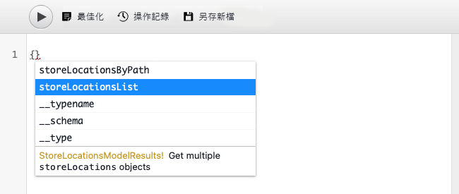

1. 為您選取的內容片段模式定義查詢應包含的項目。 再次輸入左方括號 `{`，然後按 Ctrl+Space 或 Option+Space 以獲得自動完成清單。從清單中選取 `items`。

   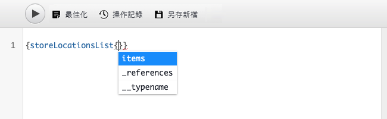

1. 為您選取的內容片段模式定義查詢應包含的欄位。 再次，輸入左方括號 `{`，然後按 Ctrl+Space 或 Option+Space，可獲得內容片段模式中適用欄位的自動完成清單。 從清單中選取您希望從模式中選取的欄位。

   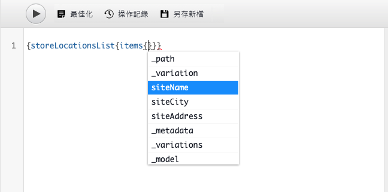

1. 用逗號 (`,`) 或空格分隔多個欄位，然後再次按 Ctrl+Space 或 Option+Space 以選擇其他欄位。

1. 在工作時，您可以點選或按一下「**修飾**」按鈕，自動格式化您的程式碼以便更易於閱讀。

   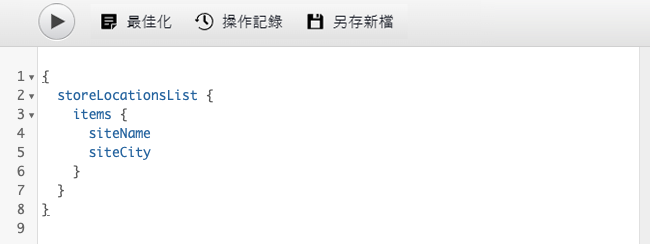

1. 完成後，在查詢編輯器左上方點選或按一下「**播放**」按鈕以進行查詢。

   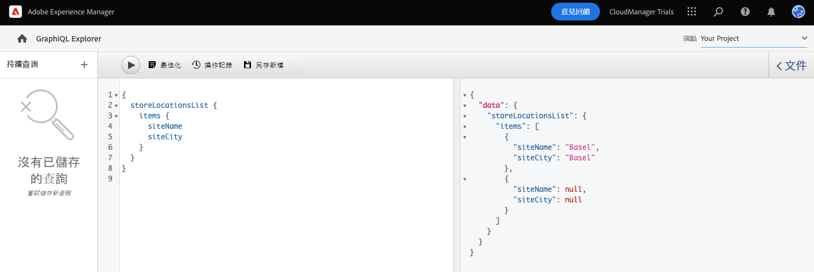

這就是將您的內容傳送至全頻道數位體驗的方式。請參閱「[其他資源部分](#additional-resources)」以獲取更多範例查詢，並了解您可以使用 GraphQL API 做更多事情。

## 您已經了解如何查詢內容！ {#conclusion}

做得很好！您已經了解關於兩種基本類型的查詢以及如何查詢您自己的內容。 請務必查看「[其他資源部分](#additional-resources)」以獲取更多範例查詢，並了解您可以使用 GraphQL API 做更多事情。

如果您想了解如何在自訂 React 應用程式中使用擷取的內容，請務必查看模組[「在範例 React 應用程式中自訂內容」。](customize-app.md)

您可以在導覽列右上方按一下「**解決方案**」按鈕，並選取 **Experience Manager**，即可返回您的試用版主畫面。

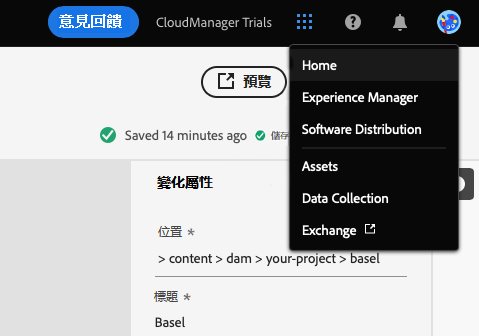

## 其他資源 {#additional-resources}

有關內容片段和 AEM 的更多資訊，請考慮查看此附加文件。

* [GraphQL API 指南](https://experienceleague.adobe.com/docs/experience-manager-learn/getting-started-with-aem-headless/graphql/multi-step/explore-graphql-api.html)
* [基本處理](/help/sites-cloud/authoring/getting-started/basic-handling.md) - 有關新用戶如何導覽和使用 AEM 的文件
* [了解透過 AEM 使用 GraphQL - 範例內容和查詢](https://experienceleague.adobe.com/docs/experience-manager-cloud-service/content/headless/graphql-api/sample-queries.html)
