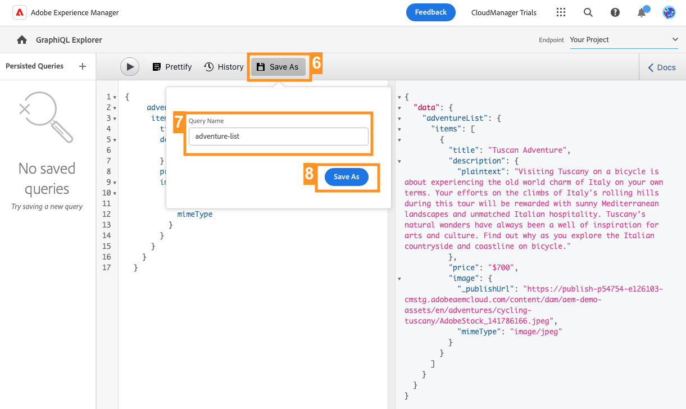

# 通過 GraphQL API 擷取內容 {#extract-content}

>[!CONTEXTUALHELP]
>id="aemcloud_sites_trial_admin_content_fragments_graphql"
>title="使用 GraphQL API 擷取內容"
>abstract="在此單元中，您將瞭解如何使用內容片段和 GraphQL API 當作 Headless 內容管理系統。"

>[!CONTEXTUALHELP]
>id="aemcloud_sites_trial_admin_content_fragments_graphql_guide"
>title="啟動 GraphQL Explorer"
>abstract="GraphQL 提供查詢式的 API，允許外部客戶端應用程式使用單一 API 呼叫，以便查詢 AEM 所需的內容。按照本單元學習如何執行兩種不同類型的查詢。然後，您將瞭解如何從您在上一個單元中建立的內容片段擷取內容。 <br><br>點選下方，在新標籤中啟動該單元。"

>[!CONTEXTUALHELP]
>id="aemcloud_sites_trial_admin_content_fragments_graphql_guide_footer"
>title="幹得好！您已經瞭解關於兩種基本類型的查詢，以及如何查詢您自己的內容。 您現在瞭解如何使用 AEM GraphQL API 建立有效率的查詢，以您應用程式預期的格式提供內容。"
>abstract=""

## 查詢範例內容清單 {#list-query}

您先從新分頁中的 GraphQL Explorer 開始。 您可以針對 Headless 內容建置和驗證查詢，再使用它們為您的應用程式或網站中的內容提供支援。

1. 您的 AEM Headless 試用版附有一個預先載入了內容片段的端點，您可以從中擷取內容以進行測試。 記得選取「**AEM 示範資產**」端點 (從編輯器右上方的「**端點**」下拉式清單中選取)。

1. 為預先載入的 **AEM 示範資產**&#x200B;端點的清單查詢複製以下程式碼片段。清單查詢將傳回使用特定內容片段模式的所有內容清單。 詳細目錄和類別頁面通常使用這種查詢格式。

   ```text
   {
    adventureList {
     items {
       _path
       title
       price
       tripLength
       primaryImage {
         ... on ImageRef {
           _path
           mimeType
           width
           height
         }
       }
     }
    }
   }
   ```

1. 貼上複製的程式碼，以取代查詢編輯器中的現有內容。

1. 貼上後，在查詢編輯器左上方按一下「**播放**」按鈕以執行查詢。

1. 結果將顯示在右側面板中 (在查詢編輯器旁邊)。 如果查詢不正確，右側面板中會出現錯誤。

   

您剛剛驗證了所有內容片段完整清單的清單查詢。 此過程有助於確保查詢的回應符合您應用程式的預期，且結果會說明您的應用程式和網站將如何擷取在 AEM 建立的內容。

>[!NOTE]
>
>如果您無法從下拉式選單選取「**AEM 示範資產**」端點，請聯絡 Adobe 客戶服務或在 [AEM 試用版 Slack 管道](https://adobe-dx-support.slack.com/)尋求協助。

## 查詢範例內容指定片段 {#bypath-query}

執行 byPath 查詢可讓您擷取特定內容片段的內容。 產品詳細資訊頁面，以及著重在通常需要這類查詢的一組特定內容頁面。

1. 為預先載入的 **AEM 示範資產**&#x200B;端點的 byPath 查詢複製以下程式碼片段。

   ```text
    {
     adventureByPath(
       _path: "/content/dam/aem-demo-assets/en/adventures/bali-surf-camp/bali-surf-camp"
     ) {
       item {
         _path
         title
         description {
           json
         }
         primaryImage {
           ... on ImageRef {
             _path
             width
             height
           }
         }
       }
     }
   }
   ```

1. 貼上複製的程式碼，以取代查詢編輯器中的現有內容。

1. 貼上後，在查詢編輯器左上方按一下「**播放**」按鈕以執行查詢。

1. 結果將顯示在右側面板中 (在查詢編輯器旁邊)。 如果查詢不正確，右側面板中會出現錯誤。

   

您剛剛驗證了 byPath 查詢，以擷取由該片段的路徑標識的特定內容片段。

## 查詢自己的內容 {#own-queries}

您現在已經進行了兩種主要類型的查詢，您可以準備查詢自己的內容了。

1. 若要針對您自己的內容片段進行查詢，請將端點從「**AEM 示範資產**」資料夾變更為「**您的專案**」資料夾。

1. 刪除查詢編輯器中的所有現有內容。然後，輸入左方括號 `{` 並按 Ctrl+Space 或 Option+Space，可獲得端點中定義的模式自動完成清單。 從選項中選取您建立且以 `List` 結尾的模式。如果您按照前面單元的範例操作，您應該會發現 `adventureList` 在自動完成清單中。

   

1. 為您選取的內容片段模式定義查詢應包含的項目。 再次輸入左方括號 `{`，然後按 Ctrl+Space 或 Option+Space 以獲得自動完成清單。從選項中選取 `items`。

1. 在工作時，您可以點選或按一下「**修飾**」按鈕，自動格式化您的程式碼以便更易於閱讀。

1. 完成後，在查詢編輯器左上方點選或按一下「**播放**」按鈕以進行查詢。編輯器自動完成 `items`，簡要地以黃色醒目標示，且查詢執行。

1. 結果將顯示在右側面板中 (在查詢編輯器旁邊)。

   

這就是將您的內容傳送至全管道數位體驗的方式。

## 持續性查詢 {#persisted-queries}

持續性查詢是將 GraphQL API 公開給用戶端應用程式的首選機制。一旦查詢被保留，就可以使用 GET 要求來要求查詢，並進行快取用於快速擷取。

您將建立一個持續性查詢，其中包含您希望用戶端應用程式取用的資料。

1. 妳將使用之前建立做為內容片段的資料，所以請確保編輯器右上角的「**端點**」下拉式選單中的「**您的專案**」端點已選取。

1. 複製下列程式碼片段。

   ```text
      {
      adventureList {
       items {
         title
         description {
           plaintext
         }
         price
         image {
           ... on ImageRef {
             _publishUrl
             mimeType
           }
         }
       }
     }
   }
   ```

1. 貼上複製的程式碼，以取代查詢編輯器中的現有內容。

   >[!NOTE]
   >
   >如果您沒有使用前面單元中提到的相同欄位描述，您將需要更新此查詢中的欄位名稱。
   >
   >使用前面提到的 GraphQL 自動完成 (Ctrl+空格鍵或 Option+空格鍵) 功能來協助識別可用屬性。

1. 貼上後，在查詢編輯器左上方按一下「**播放**」按鈕以執行查詢。

1. 結果將顯示在右側面板中 (在查詢編輯器旁邊)。 如果查詢不正確，右側面板中會出現錯誤。

   

1. 如果對您的查詢感到滿意，請按一下查詢編輯器頂端的「**另存新檔**」按鈕以保留查詢。

1. 在「**查詢名稱**」快顯視窗中，將您的查詢命名為 `adventure-list`。

1. 點選或按一下「**另存新檔**」。

   

1. 如畫面底部的橫幅訊息所確認，查詢已保留。該查詢現在也出現在視窗中的左側持續性查詢面板。

1. 為了使持續性查詢公開可用，需要將其發佈，就像您的內容片段需要發佈一樣。在查詢編輯器右上方，按一下「**發佈**」按鈕以發佈查詢。

1. 橫幅通知中會確認這項發佈。

您現在有一個新的持續性查詢，它將只包含您定義的特定屬性和格式。
