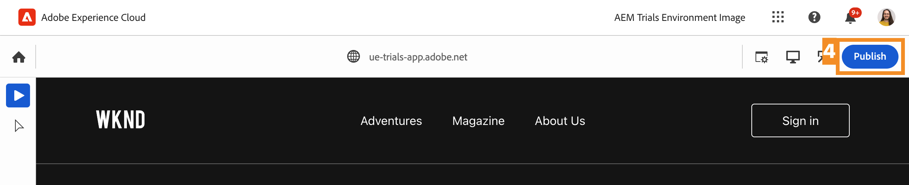
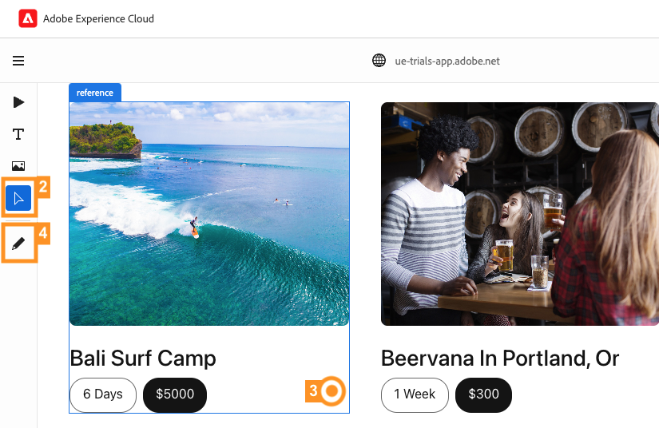

# 使用 Universal Editor 進行內容編輯 {#editing-in-context}

>[!CONTEXTUALHELP]
>id="aemcloud_sites_trial_edit_inline_universal_editor"
>title="使用 Universal Editor 進行內容編輯"
>abstract="了解無頭應用程式如何利用 Universal Editor 為作者帶來低摩擦且符合上下文的編輯體驗。"

>[!CONTEXTUALHELP]
>id="aemcloud_sites_trial_edit_inline_universal_editor_guide"
>title="啟動 Universal Editor"
>abstract="在本指南中，我們將探討 Universal Editor，以及它如何讓所有人都能在任何實施中編輯各種內容，從而提高內容流通速度。  點選下方，在新標籤中啟動此單元，然後按照本指南進行操作。"

>[!CONTEXTUALHELP]
>id="aemcloud_sites_trial_edit_inline_universal_editor_guide_footer"
>title="在本單元中，您已了解如何使用 Universal Editor 自訂符合上下文且原地出現的內容。"
>abstract=""

## 在內容中編輯文字 {#edit-text}

進行原處和內容中編輯通常會比您在之前的模組中看過的結構化 Headless 內容編輯 (如使用內容片段編輯器) 更具優勢。

>[!NOTE]
>
>若要在此試用版中使用通用編輯器，您必須使用Chrome作為瀏覽器，且不得處於無痕模式。 這是試用體驗的限制，並非 Universal Editor 的問題。

使用 Universal Editor 可讓您靈活地進行內容中和原處的文字編輯，實現簡單且直覺的內容編寫。

1. 依預設，編輯器應該會在&#x200B;**元件**&#x200B;模式下載入。如果沒有，請選取 **元件** 圖示來顯示於編輯器左側的模式邊欄中。

1. 請連按兩下最新文章的標題以進行編輯。

   

1. 選取的元件會以藍色邊框顯示，且會附上註明其為文字元件的標籤。游標會位於邊框中，等待文字輸入。將文字變更為 `Aloha Spirit in Lofoten`。

   

1. 按下Enter/Return鍵或選取文字元件外部，您的變更便會自動儲存。

Universal Editor 在編寫環境中會自動儲存您的變更。您仍然需要發佈變更內容，讀者才能看到，我們將在稍後的步驟中進行這部分。

## 在內容中編輯媒體 {#edit-media}

使用 Universal Editor，您還可以在將影像交換出去的同時仍停留在內容中。

1. 剩餘時間 **元件** 模式，選取瀏覽者的影像以選取它。

1. 在元件邊欄中，您可以查看資產的詳細資料。選取 **精選影像** 縮圖。

   

1. 在 **選取資產** 下，捲動並選取 `surfer-wave-02.JPG` 影像以選取它。

1. 選取 **選取** 在 **選取資產** 視窗。

   

該影像會以您選取的影像取代。

## 像讀者一樣體驗您的內容 {#emulators}

Universal Editor 可讓您在其中與內容互動、查看傳遞到使用者裝置上的內容。

1. 根據預設，編輯器會呈現內容的桌面版本。選取編輯器右上角的模擬器按鈕，以變更目標裝置。

   

1. Reader可能位於外觀比例不同的不同裝置上，因此編輯器會提供模擬模式，以檢視將向使用者呈現頁面的方式。 例如，選取直向模式的行動裝置選項。

   

1. 在編輯器中查看內容變更。模擬器的圖示也會變更，以反映其所處的模式。選取模擬器選單之外的任意位置，以關閉模擬器選單並與內容互動。

1. 將模擬器返回桌面模式。

您也可以指定模擬器的確切尺寸，並旋轉模擬裝置，以在任何潛在的目標裝置上檢視您的內容。

## 預覽和發佈 {#preview}

由於您需要選取內容才能在編輯器中選取內容，編輯器不允許您在內容處於編輯模式時，透過點選或按一下來追蹤連結或與內容互動。 使用預覽模式的話，您即可開啟內容中的連結並在發佈之前像使用者一樣體驗內容。

1. 在編輯器左側的模式欄中，選取 **預覽**.

1. 現在選取 **瞭解詳情** 主要文章的連結。

   

1. 瀏覽文章，然後使用&#x200B;**返回**&#x200B;連結，返回主要頁面。

   

1. 現在選取 **發佈** 按鈕來發佈您的內容。

   

您的內容已發佈。

## 編輯內容片段 {#editing-fragments}

當 Headless 內容的結構化編輯比原處編輯更具優勢時，為了加速您的內容編寫體驗，Universal Editor 還會讓您快速存取內容片段編輯器。

1. 在頁面上進一步向下捲動到「**冒險**」區段。

1. 在編輯器左側的模式邊欄中，選取「**元件**」。這讓您可在編輯器中選取頁面元件。

1. 選取以下其中一個冒險 **巴厘島衝浪營** 以選取它。

   * 請注意已選取元件的藍色輪廓。選取內容片段時，標籤應顯示內容片段的名稱。在此例中為&#x200B;**峇里島衝浪營**。
   * 由於 Universal Editor 可容許選取頁面上的任何物件，因此也可以個別選取內容片段的組成元件。選取插圖中所示的位置，以選取整個內容片段元件。

1. 此時在元件邊欄上會顯示「**編輯**」圖示。選取 **編輯** 圖示在新標籤上開啟內容片段編輯器。

您現在可以在新的索引標籤上編輯在 Universal Editor 中選取的內容片段。
